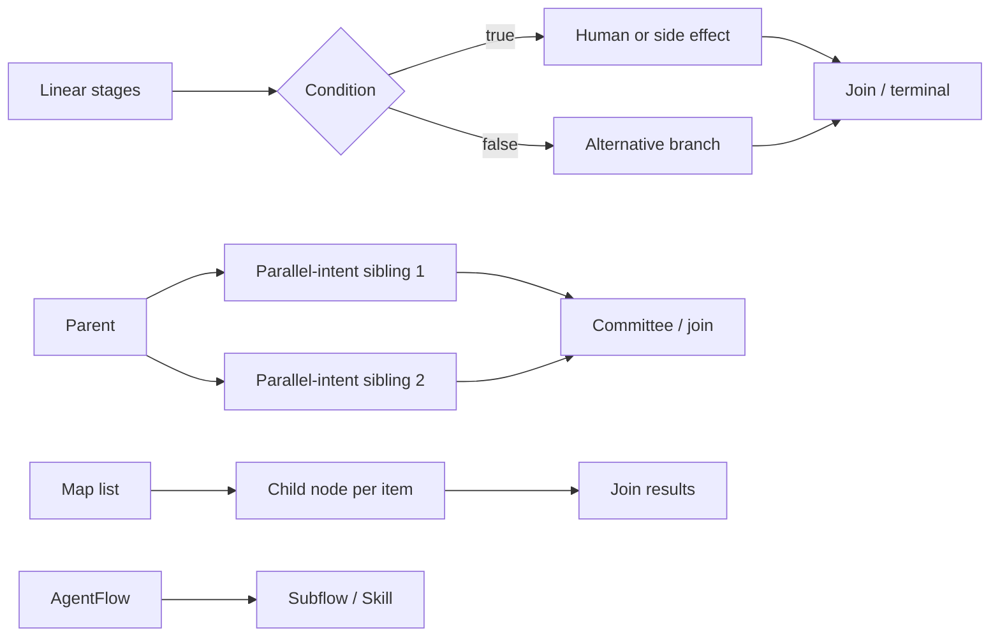

# AgentFlow Application Architecture

[System overview](overview.md) · [JobManager](engine/jobmanager.md) · [TaskManager](engine/taskmanager.md) · [Application index](../index.md#applications)

**Layer:** L2 application orchestration above the L1 engine components

**Runtime placement:** one required `runtime_mode` (`application` or `session`)

AgentFlow is the application-facing DAG model. It defines which work is
deterministic, which work may use an LLM, how outputs move between nodes, where
approval is required, and which side effects are permitted. The L1 engine
persists, schedules, dispatches, isolates, and observes the configured graph.
Concrete application nodes, edges, integrations, and E2E evidence belong to
the owning `usecase/{use-case}/README.md`, linked from the use-case catalog.

```text
Flow manifest + Agent/MCP/Skill definitions
                    │
                    ▼
          API Server validates/imports
                    │
                    ▼
       JobManager resolves DAG readiness
                    │ ExecutionPlan
                    ▼
       TaskManager executor router
          │       │         │
          │       │         └──► Sandbox worker
          │       └────────────► Remote MCP / external system
          └────────────────────► LLM provider
                    │
                    ▼
       state, approvals, results, notifications
```

| Part | Purpose |
|---|---|
| [DAG model and patterns](#manifest-and-dag-model) | Canonical manifest, data flow, composition, and 12 node types |
| [Limits and practices](#flexibility-and-current-limits) | Current execution boundaries and safe authoring rules |
| [Application resources](#agent-node-memory) | Memory, skills, agents, static manifests, and console lifecycle |

## Manifest and DAG Model

The current use cases use the console resource envelope:

```yaml
consoleVersion: core.flowgent.io/v1
kind: Flow
metadata:
  name: example-flow
  namespace: default
  status: active
data:
  id: example-flow
  runtime_mode: application
  resources:
    jobmanager: { cpu: "500m", memory: "512Mi" }
    taskmanager: { cpu: "2", memory: "2Gi" }
    sandbox: { cpu: "2", memory: "2Gi" }
  vars: {}
  triggers: []
  nodes: []
  edges: []
```

The importer accepts exactly this envelope version and `data` payload. Every DAG
node is one flat object with a required `kind`; node parameters use `args`.
Unknown envelope and API request fields are rejected.

| Flow field | Purpose | Flexibility / boundary |
|---|---|---|
| `id`, `namespace`, `labels` | Identity and ownership | IDs must be stable because state, memory, topics, and runtime names depend on them |
| `vars` | Defaults available as `${vars.name}` | Run variables override defaults; secrets should enter through runtime Secrets, not manifests |
| `nodes` | Typed units of execution | Node IDs are unique within a flow and execute at most once in the current run state model |
| `edges` | `from`/`to` dependencies | Optional edge `condition` is boolean only and matches a condition node result |
| `triggers` | Schedule or webhook registration | REST and A2A can also create runs outside manifest trigger declarations |
| `input_schema`, `output_schema` | Discovery and validation contracts | Optional; node-level `output_schema` is strongly recommended for LLM output |
| `sandbox_policy` | Flow-level sandbox defaults | A node may narrow or override policy within the configured security boundary |
| `runtime_mode` | Flink-style runtime lifecycle | Required; `application` creates a per-run runtime cluster, `session` uses the Helm-deployed shared runtime |
| `resources` | Application-mode pod-size overrides | Optional; may set `jobmanager`, `taskmanager`, and `sandbox` CPU/memory only. Replicas and slots remain platform defaults |

Inputs are resolved recursively immediately before execution. Exact references
such as `${node.field}` preserve arrays and objects as typed values; embedded
references are string interpolation. A node may reference any previously
completed node output, although depending only on declared ancestors keeps the
graph auditable.

## Supported Composition Patterns



| Pattern | Configuration | Current behavior |
|---|---|---|
| Linear pipeline | One outgoing edge per stage | Fully supported |
| Fan-out / fan-in | Sibling nodes plus committee or join | Dependency semantics are supported; ready siblings are currently dispatched sequentially |
| Boolean branch | `condition` node plus true/false edges | Supported; non-matching direct children are skipped |
| Human gate | `human.approval` with timeout/action | Persisted pause/resume boundary |
| Bounded node retry | `retry.max/initial/max_delay/factor` | JobManager-owned; each attempt is a distinct, parent-linked TaskRun and OTel attempt span |
| Map and join | `map.source`, child node, concurrency, then `join` | Nested fan-out is modeled; control payload size and concurrency |
| Nested flow | `agentflow` node | Reuses a flow as a subflow |
| Skill | `skill` node | Reuses a skill-kinded sub-AgentFlow |
| Isolated script | `sandbox` runtime/script/policy | Executed by independent Sandbox workers |
| Feedback loop | Conditional back-edge | Representable in YAML, but an already completed node is not reset; repeated-node loop semantics are not currently implemented |

## Supported Node Types

| Type | Executor | Use and configuration boundary |
|---|---|---|
| `agent` | AgentExecutor | LLM reasoning with agent, instruction, args, and optional JSON output schema |
| `tool` | ToolExecutor | Explicit remote MCP invocation selected by the DAG; HTTP Streamable transport only |
| `condition` | ConditionExecutor | Deterministic boolean expression used by true/false edges |
| `supervisor` | SupervisorExecutor | LLM control decision constrained by allowed actions and retry/node/injection quotas |
| `committee` | CommitteeExecutor | Deterministic majority decision over already-produced votes |
| `human` | HumanExecutor | Persisted approval gate with timeout and approve/reject behavior |
| `map` | MapExecutor | Fan-out over a list with a child node and configured concurrency |
| `join` | JoinExecutor | Merge map or fan-out results |
| `agentflow` | SubflowExecutor | Nested AgentFlow execution; runtime task type is `subflow` |
| `skill` | SkillExecutor | Dispatch a skill-kinded sub-AgentFlow |
| `sandbox` | SandboxExecutor | Bash, Python, or Node script with resource/workspace/network policy |
| `noop` | NoopExecutor | Terminal or pass-through node |

Only `agent` and `supervisor` intentionally use an LLM. Tool selection,
branching, voting, approval, fan-out, joining, script dispatch, and terminal
behavior remain explicit in the graph.

## Flexibility and Current Limits

| Area | Flexible configuration | Current limit |
|---|---|---|
| Runtime topology | Same flow model across standalone and distributed execution | Distributed Flows choose `application` per-run isolation or `session` shared runtime |
| Scheduling | Dependencies, conditional branches, retries, map concurrency | JobManager blocks on each `Schedule()`; ready siblings do not execute concurrently yet |
| Cycles | Back-edges can be parsed | Node state is one-shot; back-edges do not rerun a completed node |
| Conditions | True/false edges from a condition result | Edge conditions are booleans, not arbitrary expressions; put expressions in the condition node |
| Failure | Node failure, timeout, retry, checkpoint state | A malformed graph with no ready node can leave pending work; validate reachability and acyclicity |
| MCP tools | Any independently deployed Streamable HTTP MCP service | No stdio subprocess MCP transport inside TaskManager |
| LLM output | Per-agent/model controls and per-node JSON schema | Unstructured output weakens interpolation, voting, and auditability |
| Memory | Persistent memory by `(flow_id, node_id)` | No run-scoped isolation in this model and no cross-flow memory sharing |
| Sandbox | Runtime, timeout, resources, workspace, allow/deny network policy | Requires supported Linux/Kubernetes isolation features; allowlists must include actual proxy endpoints |
| Dynamic control | Supervisor retry/redirect/inject/abort | Actions and quotas are mandatory boundaries; supervisor is not an unrestricted ReAct loop |

## Best Practices

1. Keep side effects in explicit `tool` or `sandbox` nodes; agents should
   analyze or generate structured decisions, not hide network or Git mutations.
2. Put `output_schema` on every agent whose result drives interpolation,
   conditions, committee votes, commits, or reports.
3. Fan out independent reviews, then converge through a deterministic
   `committee` or `join`. Treat current sibling execution as logically
   parallel but physically sequential.
4. Place human approval immediately before irreversible external side effects.
5. Make side-effect nodes idempotent: query existing state before creating a
   branch, pull request, ticket, or deployment.
6. Use node retry for bounded polling. Do not rely on a back-edge to rerun an
   already completed node until explicit loop/reset semantics exist.
7. Pass large artifacts through the shared workspace and bounded references;
   avoid copying full source trees or scan payloads through every task row.
8. Keep sandbox network policy concrete and minimal. Include the actual proxy
   host/port when a script connects through a proxy.
9. Use stable node IDs. They are part of task identity, output references,
   memory scope, traces, and workspace paths.
10. End every branch deliberately through a join or terminal node, and validate
    that no branch can leave permanently pending nodes.

## Application Invariants

| Constraint | Rationale |
|-----------|-----------|
| Only `agent` and `supervisor` use LLM | All other nodes must be deterministic |
| Vote must be deterministic | LLM "judges", vote "decides" |
| Agent output must be JSON | Machine-readable, auditable |
| Supervisor actions constrained | redirect/retry/inject/abort only |
| Human node must persist + timeout | DB-backed, resume via API |
| Map must support nesting | Multi-level fan-out |

---


## Agent Node Memory

Each (flow_definition, node) pair accumulates a persistent memory entry. Unlike
run-scoped memory, `NodeMemory` survives across ALL runs of the same flow —
restarts and interruptions automatically benefit from prior execution context.

### Model

```go
type NodeMemory struct {
    FlowID    string         // agentflow definition ID (NOT run ID)
    NodeID    string         // DAG node ID (empty = flow-level shared)
    Content   string         // accumulated execution context (appended each run)
    Embedding []float32      // vector for similarity search
    Metadata  map[string]any // {retry_count, last_error, last_model, token_usage, ...}
}
```

**Scoping rule**: memory is keyed by `(flow_id, node_id)` — same flow definition + same
node, across all runs. Run ID is NOT part of the key. Cross-flow memory sharing is
intentionally NOT supported (simplicity).

### Lifecycle

```
1. BEFORE LLM call:
   GetMemory(flowID, nodeID)
   → if found, append prior content to prompt as context

2. AFTER each attempt:
   UpsertMemory({ flowID, nodeID, content })  ← accumulates, doesn't replace

3. Content grows monotonically:
   "attempt=0 prompt=... response=... error=..."
   "attempt=1 prompt=... response=..."
   → Richer context for every subsequent run
```

### PG Schema

```sql
CREATE TABLE node_memories (
    flow_id    VARCHAR(255) NOT NULL,
    node_id    VARCHAR(255) NOT NULL DEFAULT '',
    content    TEXT NOT NULL,
    embedding  JSONB,
    metadata   JSONB DEFAULT '{}',
    created_at TIMESTAMPTZ DEFAULT NOW(),
    updated_at TIMESTAMPTZ DEFAULT NOW(),
    PRIMARY KEY (flow_id, node_id)
);
```

### Store Interface

```go
type NodeMemoryStore interface {
    GetMemory(ctx, flowID, nodeID string) (*NodeMemory, error)
    UpsertMemory(ctx, mem *NodeMemory) error
    SearchMemory(ctx, flowID string, embedding []float32, topK int) ([]NodeMemory, error)
    ListFlowMemories(ctx, flowID string) ([]NodeMemory, error)
    DeleteMemory(ctx, flowID, nodeID string) error
}
```

The `AgentExecutor` accepts an optional `NodeMemoryStore`; when present, memory is
persisted after each attempt and queried before LLM calls.

---


## Skills as Sub-AgentFlows

### Core Insight

**A Skill is a sub-AgentFlow.** Nothing more. A "skill" accomplishes a task — which inherently means orchestrating multiple tools and/or agents. That's exactly what an AgentFlow is. Users migrating from Claude Code, Codex, Copilot, or any other agent framework can drop their existing skills into Flowgent as AgentFlow YAML files and reference them as `kind: agentflow` nodes.

No new abstractions. No new executors. No ReAct loop. No mandatory schema.

### AgentFlowSpec — Optional Fields for Skills

```go
type AgentFlowSpec struct {
    ID           string         `json:"id" yaml:"id"`
    Kind         string         `json:"kind,omitempty" yaml:"kind,omitempty"`           // "skill" | "" (empty = regular flow)
    Description  string         `json:"description,omitempty" yaml:"description,omitempty"`
    Summary      string         `json:"summary,omitempty" yaml:"summary,omitempty"`     // one-liner for A2A card
    InputSchema  *JSONSchema    `json:"input_schema,omitempty" yaml:"input_schema,omitempty"`
    OutputSchema *JSONSchema    `json:"output_schema,omitempty" yaml:"output_schema,omitempty"`
    Vars         map[string]any `json:"vars,omitempty" yaml:"vars,omitempty"`
    Nodes        []Node         `json:"nodes" yaml:"nodes"`
    Edges        []Edge         `json:"edges" yaml:"edges"`
    Triggers     []TriggerDef   `json:"triggers,omitempty" yaml:"triggers,omitempty"`
}
```

`input_schema` and `output_schema` are entirely optional. Schemas are purely for A2A discovery and optional validation.

### Canonical Skill Flow

```yaml
# etc/skills/01-dependency-scan.yaml
consoleVersion: core.flowgent.io/v1
kind: Flow
metadata:
  name: dependency-scan
data:
  id: dependency-scan
  kind: skill
  summary: "Scan project dependencies for known CVEs"
  nodes:
    - id: clone
      kind: tool
      tool: github
      args:
        action: clone_repo
        url: ${vars.repo_url}
    - id: scan
      kind: tool
      tool: dependency-checker
      args:
        path: ${clone.output.path}
    - id: normalize
      kind: agent
      agent: issue-detector
      args:
        raw_output: ${scan.output}
  edges:
    - { from: clone, to: scan }
    - { from: scan, to: normalize }
```

Reference from any flow: `kind: agentflow`, `agentflow: dependency-scan`.

## Agent Definitions

### Tools Belong to the DAG, Not the Agent

Tools are deterministic DAG nodes (`kind: tool`). The flow designer decides which tool to call, at which step, with which inputs. The agent receives tool output and reasons about it — it never decides to call a tool itself. This is the architectural line between enterprise orchestration (DAG-controlled) and personal AI assistants (ReAct loop).

### AgentDef — Structured Additions

```go
type AgentDef struct {
    Name         string      `json:"name" yaml:"name"`
    Model        string      `json:"model" yaml:"model"`
    Soul         string      `json:"soul" yaml:"soul"`
    Instruction  string      `json:"instruction" yaml:"instruction"`
    OutputSchema *JSONSchema `json:"output_schema,omitempty" yaml:"output_schema,omitempty"`
    Temperature  *float64    `json:"temperature,omitempty" yaml:"temperature,omitempty"`
    MaxTokens    int         `json:"max_tokens,omitempty" yaml:"max_tokens,omitempty"`
}
```

| Field | Why |
|-------|-----|
| `output_schema` | Structured output contract — replaces prose "Output STRICT JSON: {...}" in `instruction`. Enables validation. |
| `temperature` | Per-agent override. Supervisor needs 0.2; creative reviewer may want 0.5. |
| `max_tokens` | Output length control per agent role. |

---


## Directory-Based Configuration

### Config Layout

```yaml
orchestration:
  mcps: [...]
  agents:
    static:  { enabled: true, load-dir: "agents/",  refresh: 30s }
    standard: { enabled: false }   # DB-backed (future UI)
  skills:
    static:  { enabled: true, load-dir: "skills/",  refresh: 30s }
    standard: { enabled: false }
  agentflows:
    static:  { enabled: true, load-dir: "flows/",   refresh: 1m }
    standard: { enabled: false }
```

### Directory Layout

Project use cases keep executable resources together while the root `etc/`
directory holds the annotated engine configuration:

```tree
etc/
└── flowgent.yaml

usecase/{use-case}/config/
├── agents/                  # Agent definitions
├── flows/                   # Flow manifests
├── mcps/                    # Remote MCP definitions
├── skills/                  # Skill manifests and resources
├── llmproviders/            # Model/provider definitions when needed
└── notifiers/               # Delivery-channel definitions when needed
```

Numeric filename prefixes are optional and are useful when human-readable load
order matters. The loader processes YAML files alphabetically; semantic DAG
order comes from edges, never filenames.

### Static Manifest Loader

```go
func loadResourceDir[T any](dir string) ([]T, error) {
    entries, _ := os.ReadDir(dir)
    var result []T
    for _, e := range entries {
        if e.IsDir() || filepath.Ext(e.Name()) != ".yaml" { continue }
        data, _ := os.ReadFile(filepath.Join(dir, e.Name()))
        var item T
        yaml.Unmarshal(data, &item)
        result = append(result, item)
    }
    return result, nil
}
```

---


## Flowgent Console and Resource Lifecycle

The `flowgent console` is the offline resource management tool for Flowgent.
It provides import/export and CRUD for all resource kinds, enabling seamless
migration between environments (dev → staging → production) and backup/restore
workflows.

### Architecture

```
┌──────────────────────────────────────────────────────────────────┐
│                    Flowgent Console (REPL)                        │
│                                                                   │
│  ┌──────────┐  ┌──────────┐  ┌──────────┐  ┌──────────────────┐ │
│  │  Export   │  │  Import  │  │   CRUD   │  │   Lazy Stores    │ │
│  │  Engine   │  │  Engine  │  │  (list/  │  │   (agents, flows, │ │
│  │  (YAML/   │  │  (YAML/  │  │   get/   │  │    runs, channels,│ │
│  │   JSON)   │  │   JSON)  │  │   add/   │  │    llm, mcps)     │ │
│  │           │  │          │  │  remove) │  │                   │ │
│  └─────┬─────┘  └────┬─────┘  └────┬─────┘  └────────┬──────────┘ │
│        │              │             │                  │            │
│        └──────────────┴─────────────┴──────────────────┘            │
│                              │                                     │
│                     FlowgentConsole                                │
│                    (lazy store init)                               │
│                              │                                     │
│                     ┌────────┴────────┐                            │
│                     │    IStore (DB)  │                            │
│                     │  PG / SQLite    │                            │
│                     └─────────────────┘                            │
└──────────────────────────────────────────────────────────────────┘
```

### Supported Resource Kinds

| Kind | CLI Name | REST Endpoint | Export | Import | CRUD (list/get/add/remove) |
|------|----------|---------------|--------|--------|---------------------------|
| Agent | `agent` | `/api/v1/{namespace}/agents` | yes | yes | yes |
| MCP | `mcp` | `/api/v1/{namespace}/mcp` | yes | yes | yes |
| LLMProvider | `llm` | `/api/v1/{namespace}/llm/providers` | yes | yes | yes |
| NotifyChannel | `channel` | `/api/v1/{namespace}/notifications/channels` | yes | yes | yes |
| Skill (Flow with kind=skill) | `skill` | (no REST endpoint — import/console only) | yes | yes | yes |
| AgentFlow | `flow` | `/api/v1/{namespace}/flows` | yes | yes | yes |
| FlowRun | `flowrun` | `/api/v1/{namespace}/runs` | yes | yes | yes |

### Import/Export Design

**Golden rule**: Export → Import must be seamless and lossless. Resources
exported from one Flowgent instance must re-import cleanly into another,
regardless of backend (PG → SQLite or vice versa).

Wallet private keys are not Flowgent resources. They are managed offline by the
external Wallet service and cannot appear in Flowgent import/export data.

**Output format** is auto-detected from file extension:
`.json` → JSON (indented), `.yaml`/`.yml` → YAML.

### CLI Usage

```bash
# Interactive REPL
flowgent console -c etc/flowgent.yaml

# Batch export — all supported Flowgent resource kinds
flowgent console -c etc/flowgent.yaml -- export --output /tmp/backup.yaml

# Batch export — filtered by kind
flowgent console -c etc/flowgent.yaml -- export \
  --kind mcp,llm,agent,flow,flowrun,skill,channel \
  --output /tmp/flowgent_data.json

# Import from files/directories (supports glob patterns)
flowgent console -c etc/flowgent.yaml -- import config/agents/*.yaml
flowgent console -c etc/flowgent.yaml -- import config/mcps/
flowgent console -c etc/flowgent.yaml -- import /tmp/backup.yaml
```

### Import File Format — K8s-Style Single Resource

Each YAML/JSON file uses a Kubernetes-style resource wrapper. The importer
accepts `apiVersion` or `consoleVersion`, and accepts `spec` or `data` as the
resource payload. Current use cases use `consoleVersion` + `data`; the following
`apiVersion` + `spec` form remains supported:

```yaml
apiVersion: console.flowgent.io/v1
kind: MCP
metadata:
  name: example-service
  namespace: default
  labels:
    catalog: example
  status: active
  description: Example Streamable HTTP MCP service
spec:
  enabled: true
  type: http
  url: https://mcp.example.com/mcp
```

Valid `kind` values: `Agent`, `MCP`, `LLMProvider`, `Flow`, `FlowRun`, `Skill`,
`NotifyChannel`. The `spec` or `data` block is the raw entity payload —
identical to what the REST API accepts.

### Import File Format — Bulk ExportData

For full backups, the export produces a single file containing all resources in
a top-level container:

```yaml
llms:
  - id: deepseek
    provider: deepseek
    model: deepseek-chat
    ...
mcps:
  - name: example-service
    enabled: true
    type: http
    url: https://mcp.example.com/mcp
    ...
agents:
  - name: supervisor
    model: deepseek/deepseek-chat
    soul: ...
    ...
agentFlows:
  - id: example-flow
    kind: flow
    nodes: [...]
    edges: [...]
skills:
  - id: example-skill
    kind: skill
    nodes: [...]
    edges: [...]
flowRuns:
  - id: run-abc123
    agentFlowID: example-flow
    status: COMPLETED
    ...
channels:
  - id: slack-alerts
    type: slack
    ...
```

This format supports seamless re-import: `ImportAll()` iterates each section
and writes to the corresponding store.

### E2E Migration Workflow

```bash
# 1. Export from production
flowgent console -c etc/prod.yaml -- export --output /tmp/prod-export.yaml

# 2. Import to staging (validates the exported file)
flowgent console -c etc/staging.yaml -- import /tmp/prod-export.yaml

# 3. Or — import individual resource files from a config directory
flowgent console -c etc/dev.yaml -- import \
  usecase/my-application/config/agents/ \
  usecase/my-application/config/flows/ \
  usecase/my-application/config/mcps/ \
  usecase/my-application/config/skills/
```

### Module Dependency

`console` depends on `config` (FlowgentConfig), `model` (entities), and `store`
(database access). It sits at
the same level as `core` in the dependency graph — both are mid-tier modules
that `cmd` orchestrates. See the
[shared module map](overview.md#code-layout-and-shared-module-map).

```
config + model + store
         ↑
       console
         ↑
        cmd (→ everything, including console)
```

## Expected Behavior

1. **Given** a valid flow manifest, **when** it is imported, **then** node IDs,
   edges, variables, schemas, and runtime policies MUST survive persistence and
   retrieval without semantic change.
2. **Given** a node whose dependencies are incomplete, **when** JobManager
   evaluates readiness, **then** that node MUST NOT be dispatched.
3. **Given** a condition result, **when** outgoing boolean edges are evaluated,
   **then** matching children MUST remain eligible and non-matching children
   MUST become `SKIPPED` deterministically.
4. **Given** an agent result used by another node, **when** execution succeeds,
   **then** its declared `output_schema` MUST be satisfied before downstream
   interpolation or voting relies on it.
5. **Given** a side effect such as a commit, PR, or notification, **when** the
   flow reaches it, **then** the effect MUST occur in an explicit tool or
   sandbox node after all configured deterministic and human gates.
6. **Given** a supervisor node, **when** it proposes control changes, **then**
   only configured actions within retry, node, and injection quotas may apply.
7. **Given** a back-edge to an already completed node, **when** the current
   runtime evaluates the graph, **then** the node MUST NOT be represented as a
   newly executed iteration; authors MUST use supported retry/subflow semantics.
