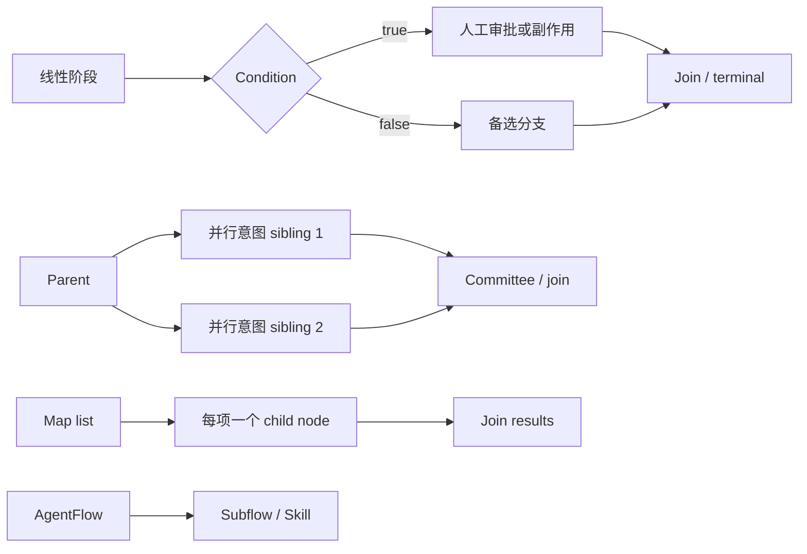

# AgentFlow 应用架构

[English](agent-flow.md) · [系统总览](overview_ZH.md) · [JobManager](engine/jobmanager_ZH.md) · [TaskManager](engine/taskmanager_ZH.md) · [应用索引](../index_ZH.md#应用)

**层级：** L1 引擎组件之上的 L2 应用编排

**运行时绑定：** 每个 Flow 必须声明一个 `runtime_mode`（`application` 或 `session`）

AgentFlow 是面向应用的 DAG 模型：它定义哪些工作是确定性的、哪些可使用 LLM、输出如何在节点间流动、何处需要审批，以及允许哪些副作用。L1 引擎负责持久化、调度、分派、隔离和观测这张图。具体应用的 Nodes、Edges、Integrations 与 E2E 证据归属 `usecase/{use-case}/README.md`，并由文档索引统一索引。

```text
Flow manifest + Agent/MCP/Skill definitions
                    │
                    ▼
          API Server 校验并导入
                    │
                    ▼
       JobManager 判断 DAG readiness
                    │ ExecutionPlan
                    ▼
       TaskManager executor router
          │       │         │
          │       │         └──► Sandbox worker
          │       └────────────► Remote MCP / external system
          └────────────────────► LLM provider
                    │
                    ▼
       状态、审批、结果与通知
```

| 部分 | 目的 |
|---|---|
| [Manifest 与 DAG](#manifest-与-dag-模型) | 规范 Manifest、数据流、组合方式与 12 种节点 |
| [灵活性与限制](#灵活性与当前限制) | 当前执行边界与安全编写规则 |
| [应用资源](#agent-节点记忆) | Memory、Skill、Agent、静态 manifest 与 console 生命周期 |

## Manifest 与 DAG 模型

当前用例使用 console resource envelope：

```yaml
consoleVersion: core.flowgent.io/v1
kind: Flow
metadata:
  name: example-flow
  namespace: default
  status: active
data:
  id: example-flow
  runtime_mode: application
  resources:
    jobmanager: { cpu: "500m", memory: "512Mi" }
    taskmanager: { cpu: "2", memory: "2Gi" }
    sandbox: { cpu: "2", memory: "2Gi" }
  vars: {}
  triggers: []
  nodes: []
  edges: []
```

Importer 仅接受这一 envelope 版本与 `data` 载荷。每个 DAG 节点都是一个
扁平对象，必须声明 `kind`，节点参数统一使用 `args`。未知 envelope 与 API
请求字段会被拒绝。

| Flow 字段 | 目的 | 灵活性与边界 |
|---|---|---|
| `id`, `namespace`, `labels` | 身份与所有权 | ID MUST 稳定；状态、memory、topic 与运行时名称均依赖它 |
| `vars` | `${vars.name}` 可见的默认值 | run 变量覆盖默认值；secret MUST 经运行时 Secret 注入，不写入 manifest |
| `nodes` | 有类型的执行单元 | ID 在流程内唯一；当前 run 状态模型中每节点至多执行一次 |
| `edges` | `from`/`to` 依赖 | 可选 `condition` 仅为 boolean，并匹配 condition 节点结果 |
| `triggers` | schedule/webhook 注册 | REST 与 A2A 也可在 manifest trigger 之外创建 run |
| `input_schema`, `output_schema` | 发现与校验契约 | 可选；强烈建议 LLM 节点声明 `output_schema` |
| `sandbox_policy` | 流程级沙箱默认策略 | 节点可在既定安全边界内收紧或覆盖 |
| `runtime_mode` | Flink 风格运行时生命周期 | 必填；`application` 创建每 Run runtime cluster，`session` 使用 Helm 部署的共享 runtime |
| `resources` | Application 模式 Pod size 覆盖 | 可选；只能设置 `jobmanager`、`taskmanager` 和 `sandbox` 的 CPU/Memory。副本数和 slot 由平台默认值控制 |

输入在执行前递归解析。`${node.field}` 这类完整引用保留数组和对象的类型；嵌入其他字符串的引用执行字符串插值。节点可引用任一已完成节点输出，但只依赖声明的祖先节点可令图保持可审计。

## 支持的组合模式



| 模式 | 配置 | 当前行为 |
|---|---|---|
| 线性流水线 | 每阶段一条出边 | 完整支持 |
| Fan-out / fan-in | sibling 节点后接 committee 或 join | 支持依赖语义；ready siblings 当前仍顺序分派 |
| Boolean 分支 | `condition` 节点及 true/false edges | 支持；不匹配的直接子节点被跳过 |
| 人工门禁 | 带 timeout/action 的 `human.approval` | 持久化 pause/resume 边界 |
| 有界节点重试 | `retry.max/initial/max_delay/factor` | 由 JobManager 管理；每次 attempt 是独立、Parent 关联的 TaskRun 与 OTel attempt Span |
| Map 与 join | `map.source`、child node、concurrency 后接 `join` | 支持嵌套 fan-out；必须约束 payload 与并发量 |
| 嵌套流程 | `agentflow` 节点 | 将流程复用为 subflow |
| Skill | `skill` 节点 | 复用 kind 为 skill 的 sub-AgentFlow |
| 隔离脚本 | `sandbox` runtime/script/policy | 在独立 Sandbox worker 执行 |
| 反馈环 | 条件 back-edge | YAML 可表达，但 completed 节点不会 reset；尚未实现同一节点重复循环执行 |

## 支持的节点类型

| 类型 | Executor | 用途与配置边界 |
|---|---|---|
| `agent` | AgentExecutor | LLM 推理，包含 agent、instruction、args 与可选 JSON schema |
| `tool` | ToolExecutor | DAG 显式选择的远程 MCP 调用；只支持 HTTP Streamable transport |
| `condition` | ConditionExecutor | 确定性 boolean 表达式，驱动 true/false edges |
| `supervisor` | SupervisorExecutor | LLM 控制决策，受允许动作和 retry/node/injection 配额约束 |
| `committee` | CommitteeExecutor | 对既有 vote 做确定性多数决 |
| `human` | HumanExecutor | 持久化审批门禁，带超时和 approve/reject 行为 |
| `map` | MapExecutor | 对 list fan-out，配置 child node 与 concurrency |
| `join` | JoinExecutor | 合并 map 或 fan-out 结果 |
| `agentflow` | SubflowExecutor | 执行嵌套 AgentFlow；运行时任务类型为 `subflow` |
| `skill` | SkillExecutor | 分派 kind 为 skill 的 sub-AgentFlow |
| `sandbox` | SandboxExecutor | 带资源、工作区和网络策略的 Bash/Python/Node 脚本 |
| `noop` | NoopExecutor | terminal 或 pass-through |

只有 `agent` 与 `supervisor` 有意使用 LLM。工具选择、分支、投票、审批、fan-out、join、脚本分派和终止行为都显式存在于图中。

## 灵活性与当前限制

| 领域 | 可配置能力 | 当前限制 |
|---|---|---|
| 运行时拓扑 | standalone 与 distributed 使用同一 Flow 模型 | 分布式 Flow 选择 `application` 每 Run 隔离或 `session` 共享 runtime |
| 调度 | 依赖、条件分支、retry、map concurrency | JobManager 对每个 `Schedule()` 阻塞；ready siblings 尚未并发执行 |
| 循环 | 可解析 back-edge | 节点状态是 one-shot；back-edge 不会重跑 completed 节点 |
| 条件 | condition 结果的 true/false edges | edge condition 仅为 boolean；复杂表达式放入 condition 节点 |
| 失败 | 节点失败、超时、retry 与 checkpoint | 无 ready 节点的畸形图可能遗留 pending 工作；必须校验可达性与无环性 |
| MCP tools | 任意独立部署的 Streamable HTTP MCP 服务 | TaskManager 内不支持 stdio 子进程 transport |
| LLM 输出 | 每 agent/model 参数和每节点 JSON schema | 非结构化输出削弱插值、投票与审计 |
| Memory | 按 `(flow_id,node_id)` 持久化 | 不做 run 级隔离，也不跨 flow 共享 |
| Sandbox | runtime、timeout、resources、workspace、network allow/deny | 依赖 Linux/K8s 隔离能力；allowlist 必须包含实际 proxy endpoint |
| 动态控制 | supervisor retry/redirect/inject/abort | action 与 quota 是强制边界；supervisor 不是无限制 ReAct loop |

## 最佳实践

1. 副作用放在显式 `tool` 或 `sandbox` 节点；agent 只分析或产生结构化决策，不隐藏网络或 Git 修改。
2. 任何被插值、condition、committee、commit 或 report 消费的 agent 结果都应声明 `output_schema`。
3. 独立 review 做 fan-out，再以确定性的 `committee` 或 `join` 汇合；当前 sibling 只是逻辑并行、物理顺序执行。
4. 人工审批紧邻不可逆外部副作用之前。
5. 副作用节点必须幂等：创建 branch、PR、ticket 或 deployment 前先查询现有状态。
6. 有界轮询使用 node retry；在 loop/reset 语义实现前，MUST NOT 依赖 back-edge 重跑 completed 节点。
7. 大型产物经共享工作区与有界引用传递，避免在每条 task row 中复制完整源码树或扫描载荷。
8. Sandbox 网络策略应具体且最小；经 proxy 连接时必须包含真实 proxy host/port。
9. 节点 ID 必须稳定，因为它参与 task identity、output reference、memory scope、trace 和 workspace path。
10. 每个分支必须明确到达 join 或 terminal，并校验不存在永久 pending 的路径。

## 应用不变量

| 约束 | 理由 |
|---|---|
| 只有 `agent` 和 `supervisor` 使用 LLM | 其他节点必须确定性执行 |
| Vote 必须确定 | LLM 负责判断，vote 负责决定 |
| Agent 输出必须为 JSON | 机器可读且可审计 |
| Supervisor action 受限 | 仅 redirect/retry/inject/abort |
| Human 节点必须持久化并超时 | 由 DB 支撑，经 API resume |
| Map 必须支持嵌套 | 多层 fan-out |

## Agent 节点记忆

每个 `(flow definition,node)` 对都累积一条持久 memory。`NodeMemory` 不是 run-scoped：同一流程的所有 run、重启与中断都会继承过去上下文。

```go
type NodeMemory struct {
    FlowID    string         // agentflow definition ID（不是 run ID）
    NodeID    string         // DAG node ID；空表示 flow-level shared
    Content   string         // 每个 run 追加的执行上下文
    Embedding []float32      // 相似度检索向量
    Metadata  map[string]any // retry_count、last_error、last_model、token_usage 等
}
```

作用域键为 `(flow_id,node_id)`；run ID 不参与，且有意不支持跨流程共享。

```
1. LLM 调用前：
   GetMemory(flowID, nodeID)
   → 存在则将历史 content 追加到 prompt

2. 每次 attempt 后：
   UpsertMemory({flowID, nodeID, content})  ← 累积而非替换

3. Content 单调增长：
   "attempt=0 prompt=... response=... error=..."
   "attempt=1 prompt=... response=..."
```

```sql
CREATE TABLE node_memories (
    flow_id    VARCHAR(255) NOT NULL,
    node_id    VARCHAR(255) NOT NULL DEFAULT '',
    content    TEXT NOT NULL,
    embedding  JSONB,
    metadata   JSONB DEFAULT '{}',
    created_at TIMESTAMPTZ DEFAULT NOW(),
    updated_at TIMESTAMPTZ DEFAULT NOW(),
    PRIMARY KEY (flow_id, node_id)
);
```

```go
type NodeMemoryStore interface {
    GetMemory(ctx, flowID, nodeID string) (*NodeMemory, error)
    UpsertMemory(ctx, mem *NodeMemory) error
    SearchMemory(ctx, flowID string, embedding []float32, topK int) ([]NodeMemory, error)
    ListFlowMemories(ctx, flowID string) ([]NodeMemory, error)
    DeleteMemory(ctx, flowID, nodeID string) error
}
```

`AgentExecutor` 可选接收 `NodeMemoryStore`；存在时在每次 attempt 后保存，并在 LLM 调用前查询。

## Skill 即 Sub-AgentFlow

**Skill 就是一条 sub-AgentFlow。** 一项 skill 本质上通过多个 tool/agent 完成任务，这正是 AgentFlow。来自 Claude Code、Codex、Copilot 或其他 agent framework 的 skill 可迁移为 AgentFlow YAML，再以 `kind: agentflow` 节点引用。不引入新抽象、新 executor、ReAct loop 或强制 schema。

```go
type AgentFlowSpec struct {
    ID           string         `json:"id" yaml:"id"`
    Kind         string         `json:"kind,omitempty" yaml:"kind,omitempty"` // "skill" 或空
    Description  string         `json:"description,omitempty" yaml:"description,omitempty"`
    Summary      string         `json:"summary,omitempty" yaml:"summary,omitempty"`
    InputSchema  *JSONSchema    `json:"input_schema,omitempty" yaml:"input_schema,omitempty"`
    OutputSchema *JSONSchema    `json:"output_schema,omitempty" yaml:"output_schema,omitempty"`
    Vars         map[string]any `json:"vars,omitempty" yaml:"vars,omitempty"`
    Nodes        []Node         `json:"nodes" yaml:"nodes"`
    Edges        []Edge         `json:"edges" yaml:"edges"`
    Triggers     []TriggerDef   `json:"triggers,omitempty" yaml:"triggers,omitempty"`
}
```

`input_schema` 与 `output_schema` 完全可选，只用于 A2A 发现与可选校验。

```yaml
consoleVersion: core.flowgent.io/v1
kind: Flow
metadata:
  name: dependency-scan
data:
  id: dependency-scan
  kind: skill
  summary: "Scan project dependencies for known CVEs"
  nodes:
    - id: clone
      kind: tool
      tool: github
      args: { action: clone_repo, url: "${vars.repo_url}" }
    - id: scan
      kind: tool
      tool: dependency-checker
      args: { path: "${clone.output.path}" }
    - id: normalize
      kind: agent
      agent: issue-detector
      args: { raw_output: "${scan.output}" }
  edges:
    - { from: clone, to: scan }
    - { from: scan, to: normalize }
```

任意流程可用 `kind: agentflow`、`agentflow: dependency-scan` 引用它。

## Agent 定义

工具属于 DAG，不属于 Agent。流程作者决定在何时以哪些输入调用哪个 `kind: tool`；agent 只消费工具输出并推理，不能自行决定调用工具。这是 DAG 控制的企业编排与 ReAct 型个人助手之间的架构边界。

```go
type AgentDef struct {
    Name         string      `json:"name" yaml:"name"`
    Model        string      `json:"model" yaml:"model"`
    Soul         string      `json:"soul" yaml:"soul"`
    Instruction  string      `json:"instruction" yaml:"instruction"`
    OutputSchema *JSONSchema `json:"output_schema,omitempty" yaml:"output_schema,omitempty"`
    Temperature  *float64    `json:"temperature,omitempty" yaml:"temperature,omitempty"`
    MaxTokens    int         `json:"max_tokens,omitempty" yaml:"max_tokens,omitempty"`
}
```

| 字段 | 目的 |
|---|---|
| `output_schema` | 结构化输出契约，替代 instruction 中的 prose JSON 约定并支持校验 |
| `temperature` | 每 agent 覆盖；如 supervisor 0.2、creative reviewer 0.5 |
| `max_tokens` | 按 agent role 控制输出长度 |

## 基于目录的配置

```yaml
orchestration:
  mcps: [...]
  agents:
    static:  { enabled: true, load-dir: "agents/",  refresh: 30s }
    standard: { enabled: false }
  skills:
    static:  { enabled: true, load-dir: "skills/",  refresh: 30s }
    standard: { enabled: false }
  agentflows:
    static:  { enabled: true, load-dir: "flows/",   refresh: 1m }
    standard: { enabled: false }
```

用例将可执行资源放在一起；根 `etc/` 只保存带注释的引擎配置：

```tree
etc/
└── flowgent.yaml

usecase/{use-case}/config/
├── agents/
├── flows/
├── mcps/
├── skills/
├── llmproviders/
└── notifiers/
```

数字文件名前缀可选，只影响便于人阅读的加载顺序。loader 按文件名字母序读取 YAML；DAG 语义顺序只来自 edges。

```go
func loadResourceDir[T any](dir string) ([]T, error) {
    entries, _ := os.ReadDir(dir)
    var result []T
    for _, e := range entries {
        if e.IsDir() || filepath.Ext(e.Name()) != ".yaml" { continue }
        data, _ := os.ReadFile(filepath.Join(dir, e.Name()))
        var item T
        yaml.Unmarshal(data, &item)
        result = append(result, item)
    }
    return result, nil
}
```

## Flowgent Console 与资源生命周期

`flowgent console` 是离线资源管理工具，支持所有资源类型的 import/export 与 CRUD，用于 dev → staging → production 迁移和 backup/restore。

```text
Flowgent Console (REPL)
  ├── Export Engine (YAML/JSON)
  ├── Import Engine (YAML/JSON)
  ├── CRUD (list/get/add/remove)
  └── Lazy Stores
          │
          ▼
   FlowgentConsole
          │
          ▼
     IStore (PG/SQLite)
```

| Kind | CLI 名称 | REST Endpoint | Export | Import | CRUD |
|---|---|---|---|---|---|
| Agent | `agent` | `/api/v1/{namespace}/agents` | 是 | 是 | 是 |
| MCP | `mcp` | `/api/v1/{namespace}/mcp` | 是 | 是 | 是 |
| LLMProvider | `llm` | `/api/v1/{namespace}/llm/providers` | 是 | 是 | 是 |
| NotifyChannel | `channel` | `/api/v1/{namespace}/notifications/channels` | 是 | 是 | 是 |
| Skill | `skill` | 无 REST，仅 import/console | 是 | 是 | 是 |
| AgentFlow | `flow` | `/api/v1/{namespace}/flows` | 是 | 是 | 是 |
| FlowRun | `flowrun` | `/api/v1/{namespace}/runs` | 是 | 是 | 是 |

**黄金规则：** Export → Import 必须无缝、无损，并可跨 PG/SQLite backend。
Wallet private key 不是 Flowgent resource，只能由外部 Wallet 服务离线管理，
不得出现在 Flowgent import/export data 中。输出格式由扩展名推断：`.json`
为缩进 JSON，`.yaml`/`.yml` 为 YAML。

```bash
flowgent console -c etc/flowgent.yaml
flowgent console -c etc/flowgent.yaml -- export --output /tmp/backup.yaml
flowgent console -c etc/flowgent.yaml -- export \
  --kind mcp,llm,agent,flow,flowrun,skill,channel \
  --output /tmp/flowgent_data.json
flowgent console -c etc/flowgent.yaml -- import config/agents/*.yaml
flowgent console -c etc/flowgent.yaml -- import config/mcps/
flowgent console -c etc/flowgent.yaml -- import /tmp/backup.yaml
```

单资源文件使用 Kubernetes 风格 wrapper；importer 接受 `apiVersion`/`consoleVersion` 与 `spec`/`data` 两组键。当前用例使用 `consoleVersion + data`：

```yaml
apiVersion: console.flowgent.io/v1
kind: MCP
metadata:
  name: example-service
  namespace: default
  labels:
    catalog: example
  status: active
  description: Example Streamable HTTP MCP service
spec:
  enabled: true
  type: http
  url: https://mcp.example.com/mcp
```

有效 kind 为 `Agent`、`MCP`、`LLMProvider`、`Flow`、`FlowRun`、`Skill` 和 `NotifyChannel`。`spec`/`data` 是与 REST API 相同的原始 entity payload。

全量备份使用顶层 `ExportData` 容器，包含 `llms`、`mcps`、`agents`、
`agentFlows`、`skills`、`flowRuns` 与 `channels`。`ImportAll()` 逐段写入对应
store，因而可直接回灌。

```bash
# production 导出
flowgent console -c etc/prod.yaml -- export --output /tmp/prod-export.yaml

# staging 导入并验证导出文件
flowgent console -c etc/staging.yaml -- import /tmp/prod-export.yaml

# 或导入用例目录的单项资源
flowgent console -c etc/dev.yaml -- import \
  usecase/my-application/config/agents/ \
  usecase/my-application/config/flows/ \
  usecase/my-application/config/mcps/ \
  usecase/my-application/config/skills/
```

`console` 依赖 `config`、`model` 与 `store`，在依赖图中与 `core` 同层并由
`cmd` 编排：

```
config + model + store
         ↑
       console
         ↑
        cmd
```

## 预期行为

1. **Given** 有效 flow manifest，**when** 被导入，**then** node ID、edge、variable、schema 与 runtime policy MUST 在持久化和读取后保持语义不变。
2. **Given** 依赖尚未完成的节点，**when** JobManager 判断 readiness，**then** 该节点 MUST NOT 被分派。
3. **Given** condition 结果，**when** 计算 boolean outgoing edges，**then** 匹配子节点 MUST 保持可执行，不匹配子节点 MUST 确定性进入 `SKIPPED`。
4. **Given** 会被后继节点使用的 agent 结果，**when** 执行成功，**then** 下游插值或投票前 MUST 满足声明的 `output_schema`。
5. **Given** commit、PR 或 notification 等副作用，**when** 流程到达该操作，**then** 它 MUST 在所有已配置确定性与人工门禁之后，由显式 tool/sandbox 节点执行。
6. **Given** supervisor 节点，**when** 它提出控制变更，**then** 只能应用配置允许且未超出 retry/node/injection 配额的 action。
7. **Given** 指向 completed 节点的 back-edge，**when** 当前运行时计算图，**then** MUST NOT 把它表示为新一轮执行；作者 MUST 使用已支持的 retry/subflow 语义。
