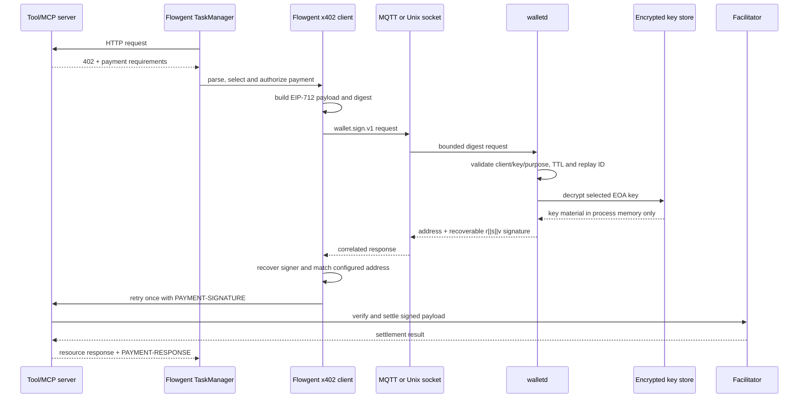

# Wallet and x402 Boundary (L1)

[中文版本](wallet_ZH.md)

Wallet is an optional, process-isolated signing service. It owns secp256k1 EOA
private keys and signs precomputed EIP-712 digests. Flowgent owns payment
orchestration and never loads, decrypts, or receives a private key.

The implementation is published from the independent
[`flowgent-wallet`](https://github.com/flowgent-labs/flowgent-wallet)
repository and pinned at repository-root `wallet/` as a git submodule. The
Flowgent release, image, and root Makefile MUST NOT build or publish Wallet.

## End-to-End Call



The message contains a 32-byte digest, not an unsigned transaction or arbitrary
business payload. This keeps Wallet independent of Flowgent, Sigbot, and x402
object models while constraining what the service can sign.

## Ownership

| Concern | Wallet | Flowgent client |
|---|---|---|
| Master key, EOA private keys, encrypted store | owns | MUST NOT access |
| Key generation, import, deletion, master-key rotation | offline `walletd` CLI | no API or console command |
| Client-to-key-to-purpose authorization | enforces | supplies configured identity |
| Request size, validity window and replay ID | enforces | creates bounded requests |
| EIP-712 digest signing | performs | verifies recovered signer |
| HTTP 402 parsing and x402 payload construction | MUST NOT perform | owns |
| Asset, chain, domain, USD amount and daily-budget policy | MUST NOT perform | owns |
| Human approval and signed resource retry | MUST NOT perform | owns |
| Facilitator verification and settlement | MUST NOT perform | resource server owns the integration |
| Authorization budget and application audit state | MUST NOT persist | owns |

If Flowgent requires human approval but no approval adapter is configured, the
payment fails closed with `ErrPaymentRequiresApproval`.

x402 v2 carries token amounts in atomic units and identifies EVM assets by
contract address. Before applying USD-denominated limits, Flowgent MUST map the
requirement to the official client's known default stablecoin for that network
and scale by its decimals. Unknown networks, unknown token contracts, and
fractional atomic-unit strings fail closed. `allowed_assets` therefore contains
contract addresses rather than display symbols such as `USDC`.

## Wire Contract

Both transports carry one JSON `SignRequest` and one JSON `SignResponse`. They
do not use Flowgent's internal `InterMessage` envelope.

| Request field | Rule |
|---|---|
| `version` | exactly `wallet.sign.v1` |
| `request_id` | UUID; identical redelivery is idempotent, conflicting reuse is rejected |
| `client_id` | safe identifier; must match a configured client-policy prefix |
| `wallet_id` | safe key alias allowed by that client policy |
| `purpose` | allowed by the same policy; Flowgent uses `x402.payment` |
| `scheme` | exactly `eip712-secp256k1` |
| `digest_b64` | base64 encoding of exactly 32 bytes |
| `issued_at`, `expires_at` | bounded Unix-second validity window |
| `metadata` | optional, bounded diagnostic context; never signed or logged |

A successful response carries the same correlation identity, the EOA address,
and a `0x`-encoded 65-byte `r || s || v` signature with `v` equal to 27 or 28.
Flowgent MUST recover the signer from the original digest and MUST reject a
different address even if the response's address field looks correct.

MQTT routing is deliberately outside Flowgent's topic namespace:

```text
publish:   wallet/v1/sign/requests/{client_id}
subscribe: $share/{consumer_group}/wallet/v1/sign/requests/+
response:  wallet/v1/sign/responses/{client_id}
```

Wallet verifies that the request topic suffix equals the JSON `client_id`.
Production broker ACLs MUST restrict each credential to its own request and
response topics. MQTT MUST use authentication and TLS outside a trusted local
network. Wallet re-establishes its shared subscription after every broker
reconnect.

Local mode exchanges the same newline-delimited JSON over a Unix socket. The
socket is mode `0600`; local mode therefore requires the client and Wallet to
share an appropriate OS identity. It remains cross-process and MUST NOT become
an in-process key library. The listener caps concurrent connections at 64 and
closes a connection that does not complete one request within five seconds.

## Key Store


- The master key file contains a random 256-bit key generated by `walletd`.
  Symlinks, non-regular files, oversized files, and group/other-readable files
  are rejected. Private-key import and MQTT password files follow the same
  owner-only file rule.
- The master key derives a key-encryption key; it does not encrypt every EOA
  record directly.
- A random data-encryption key encrypts each EOA private key independently.
  Key ID, algorithm, address, and public key are bound as associated data.
- Master-key rotation atomically rewrites only the encrypted data-key envelope.
- Store writes use mode `0600`, directories use `0700`, and metadata/key files
  are replaced atomically and fsynced.
- One process holds an exclusive store lock. Offline key commands and rotation
  therefore require `walletd serve` to be stopped.
- Secret buffers are zeroized where ownership permits, and this crate forbids
  its own `unsafe` code. These controls do not protect a compromised host.

## Configuration Boundary

Flowgent configuration contains only the external client contract and business
policy:

```yaml
wallet:
  enabled: false
  transport: mqtt
  client_id_prefix: flowgent-
  key_id: payer
  public_address: "0x..."
  sign_timeout: 30s
  local_socket: /run/wallet/wallet.sock
  policies: { ... }
  x402:
    timeout: 30s
```

Wallet listener, storage, master-key, TLS, broker credential, and authorization
policy settings belong only to Wallet's own configuration. The reference file
is [`wallet/config/wallet.example.toml`](../../../wallet/config/wallet.example.toml).
Only TaskManager constructs the payment-capable HTTP client. API Server,
Controller, JobManager, Notifier, and all-in-one administrative paths MUST NOT
open Wallet transports.

Each Wallet client policy binds one client-ID prefix to explicit key IDs and
purposes. Prefixes MUST be unique. If several prefixes match a client ID, only
the longest, most specific prefix is authoritative; a broader rule cannot grant
permissions omitted by that rule:

```toml
[[security.client_policies]]
client_id_prefix = "flowgent-"
wallet_ids = ["payer"]
purposes = ["x402.payment"]
```

## Independent Lifecycle

Wallet build, test, lint, and image commands MUST go through its own Makefile:

```bash
make -C wallet test
make -C wallet e2e
make -C wallet lint
make -C wallet verify
make -C wallet build
make -C wallet image
```

Container base images are inputs of the independent Wallet release. Its
Makefile exposes `BUILDER_IMAGE`, `RUNTIME_IMAGE`, and `DOCKER_BUILD_ARGS` so a
release pipeline can pin approved internal mirrors without changing Flowgent.

Key administration is intentionally offline:

```bash
walletd master-key generate --output /run/secrets/wallet/master.key
walletd --config config/wallet.toml key generate payer
walletd --config config/wallet.toml key import payer --private-key-file /run/secrets/payer.hex
walletd --config config/wallet.toml master-key rotate --new-key-file /run/secrets/wallet/new.key
walletd --config config/wallet.toml serve
```

The master key and broker password files MUST be readable only by the Wallet OS
user. Private keys MUST NOT be passed in command arguments, environment
variables, logs, metrics, or Flowgent manifests.

## Limits

- Implemented signing is EOA `secp256k1` over a precomputed EIP-712 digest.
  Raw-message, arbitrary-transaction, Ed25519, smart-contract-wallet, and
  general-purpose signing are unsupported.
- The encrypted-file backend is implemented. HSM, KMS, Vault, and CSI key
  backends are not implemented.
- Replay responses are bounded and retained in process memory. Idempotency does
  not survive a Wallet restart; a still-valid retry after restart is signed
  again and remains cryptographically equivalent.
- A store has one active process. High availability requires separately
  provisioned stores with the same logical key identity; automated replication
  and coordinated rotation are not implemented.
- Wallet has no REST administration surface. Health and lifecycle supervision
  are process/container concerns.
- Offline key and master-key commands validate only store configuration;
  transport and client policies are required only by `walletd serve`.
- Flowgent's default daily-budget ledger is process-local memory. Reservations
  are atomic within one ledger, but a multi-process deployment MUST provide a
  shared transactional `SpendingStore` before treating the daily limit as a
  deployment-wide cap.
- Daemon configuration has hard safety ceilings: 1,024 client policies, 256
  keys or purposes per policy, 1 MiB requests, 300-second request TTL,
  60-second clock skew, 86,400-second replay retention, and 1,000,000 replay
  entries. Operators MAY configure smaller values but cannot raise these
  compiled ceilings.

## Expected Behavior

1. **Given** a valid authorized request, **when** Wallet signs its 32-byte
   digest, **then** the returned signature MUST recover to the configured EOA.
2. **Given** a client allowed to use key A, **when** it requests key B or a
   different purpose, **then** Wallet MUST reject the request before key lookup.
3. **Given** an MQTT request, **when** its topic suffix differs from
   `client_id`, **then** Wallet MUST discard it without signing or responding.
4. **Given** an expired, future, oversized, malformed, or unsupported request,
   **when** it reaches Wallet, **then** no private-key operation may occur.
5. **Given** an identical `request_id` redelivery, **when** it remains cached,
   **then** Wallet MUST return the same response; conflicting reuse MUST fail.
6. **Given** two processes opening one store, **when** the second tries to
   acquire the lock, **then** startup MUST fail before decrypting or mutating keys.
7. **Given** a wrong or overly permissive master-key file, **when** the store
   opens, **then** startup MUST fail without rewriting store data; symlinked
   secret files MUST fail the same way.
8. **Given** master-key rotation, **when** it succeeds, **then** encrypted EOA
   records MUST remain byte-for-byte unchanged and the old master key MUST fail.
9. **Given** a Wallet response with a forged address field or wrong signature,
   **when** Flowgent receives it, **then** Flowgent MUST reject it locally.
10. **Given** `wallet.enabled=false`, **when** a tool returns HTTP 402, **then**
    Flowgent MUST NOT invoke Wallet or expose any key configuration.
11. **Given** Wallet is unavailable or client configuration is invalid, **when**
    payment handling is selected, **then** Flowgent MUST fail closed and MUST
    NOT construct a local signer.
12. **Given** a valid x402 v2 challenge, **when** Flowgent authorizes payment,
    **then** it MUST retry the resource at most once with `PAYMENT-SIGNATURE` and
    MUST NOT call the facilitator directly.
13. **Given** a signed payment attempt, **when** the retry has an ambiguous
    network outcome, **then** its amount MUST remain reserved in the local
    safety budget.
14. **Given** a Wallet source change, **when** it is accepted, **then** its own
    Makefile tests and E2E MUST pass independently of the Flowgent root Makefile.
15. **Given** an x402 requirement using an unknown network or token contract,
    **when** Flowgent evaluates a USD policy, **then** it MUST reject the payment
    instead of guessing a symbol, decimals, or exchange value.
16. **Given** overlapping client-policy prefixes, **when** a client matches more
    than one, **then** Wallet MUST authorize solely against the longest prefix;
    the broader policy MUST NOT restore omitted permissions.
17. **Given** concurrent payment attempts against one spending ledger, **when**
    their combined amount exceeds the daily cap, **then** compare-and-reserve
    MUST be atomic and no more than the configured budget may be dispatched.
18. **Given** a non-TaskManager Flowgent role, **when** Wallet is enabled in the
    shared configuration, **then** that role MUST NOT connect to Wallet or sign
    a payment.
