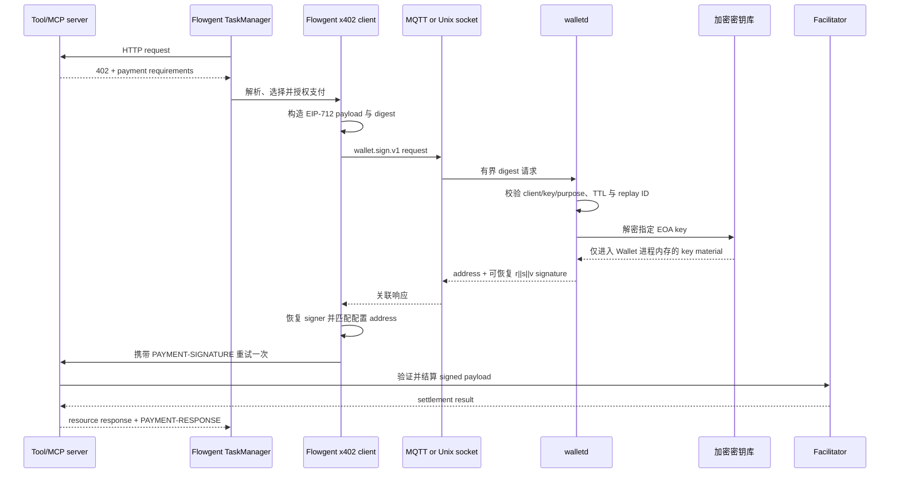

# Wallet 与 x402 边界（L1）

[English](wallet.md)

Wallet 是可选的进程隔离签名服务，持有 secp256k1 EOA 私钥并对预计算的
EIP-712 digest 签名。Flowgent 负责支付编排，永不加载、解密或接收私钥。

实现由独立的 [`flowgent-wallet`](https://github.com/flowgent-labs/flowgent-wallet)
仓库发布，并以 git submodule 固定在 Flowgent 根目录 `wallet/`。Flowgent 的
release、image 与根 Makefile **MUST NOT** 构建或发布 Wallet。

## 端到端调用



消息只承载 32-byte digest，不承载 unsigned transaction 或任意业务 payload。
因此 Wallet 不依赖 Flowgent、Sigbot 或 x402 对象模型，同时限制了可签名内容。

## 职责归属

| 关注点 | Wallet | Flowgent client |
|---|---|---|
| Master key、EOA private key、加密 store | 负责 | **MUST NOT** 访问 |
| Key generate/import/delete 与 master-key rotation | 离线 `walletd` CLI | 无 API 或 console 命令 |
| client-key-purpose 授权 | 强制执行 | 提供配置身份 |
| 请求大小、有效期与 replay ID | 强制执行 | 创建有界请求 |
| EIP-712 digest 签名 | 执行 | 恢复并校验 signer |
| HTTP 402 解析与 x402 payload 构造 | **MUST NOT** 执行 | 负责 |
| Asset、chain、domain、USD amount 与 daily budget 策略 | **MUST NOT** 执行 | 负责 |
| Human approval 与 signed resource retry | **MUST NOT** 执行 | 负责 |
| Facilitator verification 与 settlement | **MUST NOT** 执行 | 由 resource server 集成 |
| Authorization budget 与应用审计状态 | **MUST NOT** 持久化 | 负责 |

Flowgent 需要人工审批但未配置 approval adapter 时，支付以
`ErrPaymentRequiresApproval` 失败关闭。

x402 v2 使用 token 最小单位表达 amount，并用合约地址标识 EVM asset。执行
USD 限额前，Flowgent **MUST** 将 requirement 映射到官方 client 已知的该网络
默认 stablecoin，并按 decimals 缩放。未知网络、未知 token contract 与带小数的
atomic-unit 字符串都失败关闭。因此 `allowed_assets` 应配置 contract address，
而非 `USDC` 等显示 symbol。

## Wire Contract

两种 transport 都传输一个 JSON `SignRequest` 与一个 JSON `SignResponse`，
不使用 Flowgent 内部 `InterMessage` envelope。

| 请求字段 | 规则 |
|---|---|
| `version` | 必须等于 `wallet.sign.v1` |
| `request_id` | UUID；相同重投幂等，不同内容复用同一 ID 会被拒绝 |
| `client_id` | 安全 identifier，必须匹配配置的 client-policy prefix |
| `wallet_id` | 该 client policy 明确允许的 key alias |
| `purpose` | 同一 policy 允许的用途；Flowgent 使用 `x402.payment` |
| `scheme` | 必须等于 `eip712-secp256k1` |
| `digest_b64` | 恰好 32 bytes 的 base64 编码 |
| `issued_at`、`expires_at` | 有界 Unix 秒级有效窗口 |
| `metadata` | 可选、有界诊断上下文；不参与签名且不得记录日志 |

成功响应包含相同 correlation identity、EOA address，以及 `0x` 编码的
65-byte `r || s || v` signature，其中 `v` 为 27 或 28。Flowgent **MUST**
使用原 digest 恢复 signer；即使响应中的 address 字段看似正确，只要恢复出的
地址不同也 **MUST** 拒绝。

MQTT routing 刻意独立于 Flowgent topic namespace：

```text
publish:   wallet/v1/sign/requests/{client_id}
subscribe: $share/{consumer_group}/wallet/v1/sign/requests/+
response:  wallet/v1/sign/responses/{client_id}
```

Wallet 校验 request topic suffix 与 JSON `client_id` 相同。生产 broker ACL
**MUST** 将每套 credential 限制到自己的 request/response topics；可信本地网络
之外的 MQTT **MUST** 开启认证与 TLS。每次 broker 重连后 Wallet 都会重新建立
shared subscription。

Local mode 通过 Unix socket 交换相同的 newline-delimited JSON。Socket 权限为
`0600`，因此 client 与 Wallet 必须共享合适的 OS identity。它仍是跨进程边界，
**MUST NOT** 退化为进程内 key library。Listener 最多接受 64 个并发连接；单个
连接若五秒内未完成一条请求则会关闭。

## Key Store


- Master key file 保存由 `walletd` 生成的随机 256-bit key；symlink、非普通文件、
  超大文件及 group/other 可读文件都会被拒绝。Private-key import 与 MQTT
  password file 遵循相同的 owner-only 文件规则。
- Master key 派生 key-encryption key，不直接逐条加密 EOA record。
- 随机 data-encryption key 独立加密每个 EOA private key，并将 key ID、算法、
  address 与 public key 绑定为 associated data。
- Master-key rotation 只原子替换加密的 data-key envelope。
- Store 文件权限为 `0600`，目录为 `0700`；metadata/key 文件使用原子替换并
  `fsync`。
- 一个 store 只允许一个进程持有独占锁，因此离线 key 命令与 rotation 前必须
  停止 `walletd serve`。
- 所有权允许时 secret buffer 会被 zeroize，crate 禁止自身 `unsafe` code；这些
  控制无法防御已被攻陷的宿主机。

## 配置边界

Flowgent 配置只包含外部 client contract 与业务策略：

```yaml
wallet:
  enabled: false
  transport: mqtt
  client_id_prefix: flowgent-
  key_id: payer
  public_address: "0x..."
  sign_timeout: 30s
  local_socket: /run/wallet/wallet.sock
  policies: { ... }
  x402:
    timeout: 30s
```

Wallet listener、storage、master key、TLS、broker credential 与 authorization
policy 仅属于 Wallet 自身配置。参考文件为
[`wallet/config/wallet.example.toml`](../../../wallet/config/wallet.example.toml)。
只有 TaskManager 构造具备支付能力的 HTTP client。API Server、Controller、
JobManager、Notifier 及 all-in-one 管理路径 **MUST NOT** 打开 Wallet transport。

每条 Wallet client policy 将一个 client-ID prefix 绑定到明确的 key IDs 与
purposes。Prefix **MUST** 唯一。一个 client ID 同时匹配多条前缀时，仅最长、
最具体的前缀具有授权效力；宽泛规则不能补回该规则未授予的权限：

```toml
[[security.client_policies]]
client_id_prefix = "flowgent-"
wallet_ids = ["payer"]
purposes = ["x402.payment"]
```

## 独立生命周期

Wallet 的 build、test、lint 与 image 命令 **MUST** 经过自己的 Makefile：

```bash
make -C wallet test
make -C wallet e2e
make -C wallet lint
make -C wallet verify
make -C wallet build
make -C wallet image
```

Container base image 属于独立 Wallet release 的输入。Wallet Makefile 暴露
`BUILDER_IMAGE`、`RUNTIME_IMAGE` 与 `DOCKER_BUILD_ARGS`，release pipeline 可在
不修改 Flowgent 的情况下固定获批内部镜像。

Key 管理刻意设计为离线操作：

```bash
walletd master-key generate --output /run/secrets/wallet/master.key
walletd --config config/wallet.toml key generate payer
walletd --config config/wallet.toml key import payer --private-key-file /run/secrets/payer.hex
walletd --config config/wallet.toml master-key rotate --new-key-file /run/secrets/wallet/new.key
walletd --config config/wallet.toml serve
```

Master key 与 broker password 文件 **MUST** 只允许 Wallet OS user 读取。私钥
**MUST NOT** 出现在命令参数、环境变量、日志、指标或 Flowgent manifest 中。

## 限制

- 已实现的是 EOA `secp256k1` 对预计算 EIP-712 digest 的签名。Raw message、
  arbitrary transaction、Ed25519、smart-contract wallet 与 general-purpose
  signing 均不支持。
- 已实现 encrypted-file backend；HSM、KMS、Vault 与 CSI key backend 尚未实现。
- Replay response 有界并保存在进程内存。重启后不保留幂等缓存；仍在有效期内的
  retry 会再次签名，密码学结果保持等价。
- 一个 store 只有一个 active process。高可用需要独立 provision 具有相同逻辑
  key identity 的 stores；自动复制与协同 rotation 尚未实现。
- Wallet 不提供 REST 管理接口；健康检查与生命周期监控属于 process/container。
- 离线 key 与 master-key 命令只校验 store 配置；transport 与 client policy
  仅在 `walletd serve` 时必需。
- Flowgent 默认 daily-budget ledger 是进程内内存。单个 ledger 内的预留是原子的；
  多进程部署在把 daily limit 视为全局上限前，**MUST** 提供共享且事务化的
  `SpendingStore`。
- Daemon 配置具有编译期安全上限：1,024 条 client policy、每条 policy 256 个
  key 或 purpose、1 MiB 请求、300 秒请求 TTL、60 秒时钟偏差、86,400 秒 replay
  保留期及 1,000,000 条 replay 记录。运维配置 **MAY** 收紧但不能突破这些上限。

## 预期行为

1. **Given** 合法且已授权的请求，**when** Wallet 对其 32-byte digest 签名，
   **then** 返回 signature **MUST** 恢复到配置 EOA。
2. **Given** client 只允许使用 key A，**when** 请求 key B 或其他 purpose，
   **then** Wallet **MUST** 在 key lookup 前拒绝。
3. **Given** MQTT request，**when** topic suffix 与 `client_id` 不同，**then**
   Wallet **MUST** 丢弃请求且不得签名或响应。
4. **Given** 过期、超前、过大、畸形或不支持的请求，**when** 到达 Wallet，
   **then** 不得发生 private-key operation。
5. **Given** 相同 `request_id` 重投，**when** response 仍在缓存，**then** Wallet
   **MUST** 返回同一响应；不同内容复用该 ID **MUST** 失败。
6. **Given** 两个进程打开同一 store，**when** 第二个进程获取锁，**then** 必须
   在解密或修改 key 前启动失败。
7. **Given** 错误或权限过宽的 master-key file，**when** store 打开，**then**
   必须失败且不得重写 store data；symlink secret file 也 **MUST** 同样失败。
8. **Given** master-key rotation，**when** 成功，**then** 加密 EOA records
   **MUST** byte-for-byte 不变，旧 master key **MUST** 无法再打开 store。
9. **Given** Wallet response 伪造 address 字段或携带错误 signature，**when**
   Flowgent 接收，**then** Flowgent **MUST** 在本地拒绝。
10. **Given** `wallet.enabled=false`，**when** tool 返回 HTTP 402，**then**
    Flowgent **MUST NOT** 调用 Wallet 或暴露任何 key 配置。
11. **Given** Wallet 不可用或 client 配置无效，**when** 选择支付处理，**then**
    Flowgent **MUST** 失败关闭，且 **MUST NOT** 构造本地 signer。
12. **Given** 合法 x402 v2 challenge，**when** Flowgent 授权支付，**then**
    最多只能携带 `PAYMENT-SIGNATURE` 重试 resource 一次，且 **MUST NOT**
    直接调用 facilitator。
13. **Given** 已签名支付尝试，**when** retry 出现无法判定的网络结果，**then**
    其金额 **MUST** 继续占用本地安全预算。
14. **Given** Wallet source 变更，**when** 接受该变更，**then** 其自身 Makefile
    tests 与 E2E **MUST** 独立于 Flowgent 根 Makefile 通过。
15. **Given** x402 requirement 使用未知 network 或 token contract，**when**
    Flowgent 执行 USD policy，**then** 必须拒绝支付，不得猜测 symbol、decimals
    或兑换价值。
16. **Given** client-policy 前缀重叠，**when** 一个 client 同时匹配多条规则，
    **then** Wallet **MUST** 只依据最长前缀授权，宽泛 policy **MUST NOT** 补回
    最具体规则未授予的权限。
17. **Given** 多个支付并发预留同一 spending ledger，**when** 合计金额超过每日
    上限，**then** 比较与预留 **MUST** 原子执行，允许发出的金额不得超过配置预算。
18. **Given** 非 TaskManager 的 Flowgent role，**when** 共享配置启用 Wallet，
    **then** 该 role **MUST NOT** 连接 Wallet 或签署支付。
