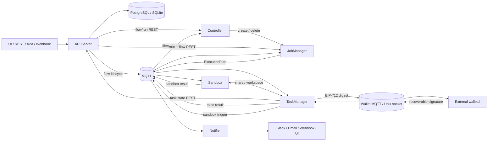

# Flowgent Distributed Orchestration Engine Architecture

**Date:** 2026-06-08

**Status:** Implemented — Flink-style application/session runtime clusters with `runtime_cluster_id` isolation

Flowgent is a distributed, multi-namespace AgentFlow engine. This overview is the
cross-component contract: it explains how the physical services call one
another, where durable state lives, how work crosses MQTT, and how a flow moves
from trigger to completion. Component internals and L2 DAG semantics live in
their owning documents.

## Architecture Map

| Layer | Document | Physical or logical ownership |
|---|---|---|
| L1 Engine | [API Server](engine/apiserver.md) | External REST/A2A gateway and sole database client |
| L1 Engine | [Controller](engine/controller.md) | Flow discovery and active-run JobManager lifecycle |
| L1 Engine | [Runtime Clusters](engine/runtime-clusters.md) | Application/session runtime lifecycle and isolation |
| L1 Engine | [JobManager](engine/jobmanager.md) | Per-run DAG readiness, plan creation, and runtime capacity |
| L1 Engine | [TaskManager](engine/taskmanager.md) | Slot workers and executor routing |
| L1 Engine | [Sandbox](engine/sandbox.md) | Isolated script execution and shared workspace |
| L1 Engine | [Notifier](engine/notifier.md) | Multi-channel delivery and WebSocket UI push |
| L1 Engine | [Wallet and x402](engine/wallet.md) | Optional external EOA key custody and EIP-712 digest signing boundary |
| L2 AgentFlow | [AgentFlow application architecture](agent-flow.md) | DAG configuration, node semantics, limits, and best practices |

## Cross-Component Call Contract



| Contract | Use | Prohibited shortcut |
|---|---|---|
| API Server REST | Durable flow, run, task, approval, and resource state | Non-API components must not connect to the DB |
| Flowgent MQTT | Lifecycle events, execution plans/results, sandbox work, and notifications | Do not use WebSocket/SSE for internal engine coordination |
| Wallet protocol | Bounded digest signing over independent MQTT topics or a Unix socket | Private keys and Wallet server configuration MUST NOT enter Flowgent |
| Shared workspace | Large scripts, repositories, and sandbox result files | Do not move large artifacts through task-state JSON |
| WebSocket | Notifier-to-UI updates and approval UX | Not an internal scheduling transport |
| Kubernetes API | Controller owns JM; JM owns TM and Sandbox | Importing metadata must not allocate runtime workers |

## System Call Architecture

Flowgent is a distributed multi-namespace AI agent orchestration engine. **Only the API Server
connects to the database** — all other Flowgent components communicate exclusively via MQTT (real-time
scheduling bus) or call the API Server REST endpoints for state updates. Optional signing crosses a
separate external Wallet protocol boundary. Internal
inter-component communication never uses SSE/WebSocket; WS is reserved for notifier→UI only.
This aligns with Kubernetes' single-etcd-access pattern and Flink's Akka-based TM coordination.

```
═══════════════════════════════════════════════════════════════════════════════════
PHASE 1 — Flow Design & Trigger (Sync)
═══════════════════════════════════════════════════════════════════════════════════

  UI / REST / A2A / Webhook          Notifier (WS push to UI only)
       │                                      ▲
       ▼                                      │
  ┌──────────────────────────────────────────┼──────────────────────────┐
  │                           API Server                               │
  │                                                                    │
  │  • Flow/Agent CRUD → PG (sole DB client)           port 9999       │
  │  • Trigger → CREATE PENDING run                    port 9992 (A2A) │
  │  • Flow lifecycle → MQTT events (create/update/delete)             │
  │  • Flow cache + hot-reload (static YAML dir)                       │
  │  • State reads/writes via REST handlers                            │
  └──────────┬─────────────────────────────────┬───────────────────────┘
             │                                 │
             ▼                                 ▼
  ┌────────────────────┐            ┌──────────────────────────────────┐
  │   PG / SQLite      │            │         MQTT (EMQX)             │
  │   (apiserver-only) │            │    real-time scheduling bus     │
  └────────────────────┘            └──────────────┬───────────────────┘
                                                   │
═══════════════════════════════════════════════════╪═══════════════════════
PHASE 2 — Scheduling (Async)                      │
═══════════════════════════════════════════════════╪═══════════════════════
                                                   │
  Controller                                       │
  • FlowgentClient.ListFlows (apiserver REST)      │
  • MQTT: subscribe lifecycle events               │
  • hash(flow_id) % N → N-way sharded              │
  • MQTT: ctrl.jm.create/{namespace}/{flow} ──────────┤  → dedicated JM
                                                   │
═══════════════════════════════════════════════════╪═══════════════════════
PHASE 3 — Execution (Async)                       │
═══════════════════════════════════════════════════╪═══════════════════════
                                                   │
  JobManager                                       │
  • FlowgentClient.ListRuns (apiserver REST)       │
  • Build DAG → ExecutionPlans                     │
  • MQTT: .../exec/plans ──────────────────────────┤  → dispatch to TM
  • MQTT: .../exec/results ← consume ──────────────┤  ← TM results
  • State: UpdateRun/SaveTask via apiserver REST   │
       │                                           │
       ▼                                           │
  TaskManager (N pods × M slots)                   │
  • $share/tm-{namespace}-{cluster}: consume ExecutionPlans │
  • ExecutorRouter: 12 node types                  │
  • Skill/sandbox nodes → dispatch via MQTT to SB  │
  • MQTT: .../exec/results ────────────────────────┤  → status to JM
  • State: SaveTask via apiserver REST (TaskStateStore) │
       │                                           │
       ▼                                           │
  Sandbox (N pods, independent Deployment)         │
  • $share/sandbox-{namespace}-{cluster}: consume triggers from TM │
  • Separate K8s pods — pod-level + seccomp-bpf    │
  • Shares workspace PVC with TM pods              │
  • MQTT: .../sandbox/result → TM                  │
                                                   │
  Notifier                                         │
  • $share/notify-pool: consume events             │
  • → Slack / Telegram / DingTalk / Email / Webhook│
  • MQTT: notify.result.{namespace}.{flow} ───────────┤  → confirmation
  • WS → UI clients only (human approval push)     │
                                                   │
  All state writes: → FlowgentClient REST → apiserver → PG/DB
═══════════════════════════════════════════════════════════════════════════
```

**Architecture constraints (aligned with K8s + Flink):**

| Constraint | Detail |
|------------|--------|
| **Only apiserver connects to DB** | Single PG/SQLite client with flow cache |
| **All other components: MQTT or apiserver REST** | controller, JM, TM, sandbox, notifier — no direct DB |
| **Management chain** | controller → JM → TM + Sandbox (JM manages both via K8sRM) |
| **State writes via apiserver** | POST/PUT REST API for run/task status updates |
| **Real-time dispatch via MQTT** | ExecutionPlan distribution, sandbox triggers, notifier events |
| **Internal communication: MQTT only** | No SSE/WS between components; WS is notifier→UI only |

### Runtime Cluster Model

Distributed execution follows a Flink-style topology with two lifecycle modes.
Helm deploys the API Server, Controller, Notifier, optional A2A gateway, and the
optional session JobManager. For `runtime_mode=application`, the Controller
creates one JobManager for each active FlowRun; that JobManager's ResourceManager
creates TM/Sandbox Deployments isolated by `runtime_cluster_id`. For
`runtime_mode=session`, the Helm-deployed session JobManager consumes session
runs and manages only workers carrying its own cluster id.

| Component | Owner | Scope |
|---|---|---|
| API Server / Controller / Notifier / A2A | Helm | platform |
| Session JobManager | Helm | namespace + session runtime cluster |
| Application JobManager | Controller | namespace + Flow + Run; active application runs only |
| TaskManager | JobManager ResourceManager | namespace + runtime_cluster_id |
| Sandbox | JobManager ResourceManager | namespace + runtime_cluster_id |

Every Flow requires `runtime_mode`. Application-mode Flow definitions may set
top-level pod-size overrides under `resources.jobmanager`, `resources.taskmanager`,
and `resources.sandbox`; replicas and slots remain platform defaults. ExecutionPlan
and SandboxTrigger topics include namespace and cluster id, and workers subscribe
only to their matching runtime cluster. See [Runtime Clusters](engine/runtime-clusters.md).

### Controller ≈ Flink Operator (Key Differences)

The Controller is Flowgent's equivalent of Flink's Operator/Dispatcher, with two
fundamental differences:

| Flink Operator | Flowgent Controller |
|---|---|
| Watches K8s CRDs (FlinkDeployment) | **Polls apiserver REST API** (FlowgentClient.ListFlows) |
| Single active (leader-elected) | **N-way sharded** (hash-mod across pods) |
| CRD-driven reconciliation | **API-scan reconciliation** (Apache ShardingSphere style) |

The API polling approach avoids CRD complexity and keeps the flow catalog
behind the apiserver as the single DB gateway.

### Deployment Namespaces and Pod Naming

Namespace isolation uses two K8s layers:

- **System namespace**: `flowgen-system` by default, configurable via
  `runtime.system_namespace` or `FLOWGENT__RUNTIME__SYSTEM_NAMESPACE`.
  Long-running platform services live here: apiserver, controller, notifier,
  a2a, and middleware deployed by Helm.
- **Workload namespace**: `{runtime.namespace.namespace_prefix}{namespaceId}`
  (default `flowgent-{namespaceId}`). Runtime workers live here:
  jobmanager, taskmanager, and sandbox. A namespace's flows share the same
  workload namespace; Flow and runtime-cluster ownership is expressed by deployment names
  and labels.

Pod names and labels carry `namespace_id` + `flow_id` for observability:

**Components** (distributed mode):

| Component | Required | K8s namespace | Role |
|-----------|----------|---------------|------|
| apiserver | yes | System namespace | REST API gateway, auth, triggers |
| controller | yes | System namespace | Flow discovery, run dispatch, hash-mod sharding |
| jobmanager | yes | Workload namespace | DAG orchestration, task scheduling |
| taskmanager | yes | Workload namespace | Runtime-cluster task execution via router (12 node types) |
| sandbox | yes | Workload namespace | Runtime-cluster isolated script execution |
| notifier | yes | System namespace | Multi-channel push + WebSocket SSE |
| a2a | **optional** | System namespace | Google Agent-to-Agent protocol endpoint |
| walletd | **optional external** | Wallet release ownership | secp256k1 EOA custody and EIP-712 digest signing |

> **Note**: `a2a` is an optional Flowgent Helm component. Wallet is deployed and
> released independently; `wallet.enabled` configures only the Flowgent client.
> All-in-one mode does not embed private-key custody.

```
System services (Helm release in flowgen-system, {hash}=K8s suffix):
  flowgent-{component}-{hash}

Application FlowRun JobManager ({hash}=K8s suffix):
  flowgent-jobmanager-{namespaceId}-{flowId}-{runId}-{hash}

Runtime-cluster workers:
  flowgent-{taskmanager|sandbox}-{namespaceId}-{clusterId}-{hash}
```

**System services:**
```
flowgent-apiserver-abc123
flowgent-controller-ghi789
flowgent-notifier-stu901
```

**Application runtime cluster:**
```
flowgent-jobmanager-default-security-autonomy-fixer-run123-xyz001
flowgent-taskmanager-default-app-run123-xyz002
flowgent-sandbox-default-app-run123-xyz003
```

Labels on all pods:
```yaml
flowgent.io/namespace:       "default"
flowgent.io/runtime-cluster: "app-run123"    # JM/TM/Sandbox
flowgent.io/runtime-mode:    "application"   # JM/TM/Sandbox
flowgent.io/managed-by:      "runtime-cluster" # TM/Sandbox
flowgent.io/runtime-boundary: "flow-jobmanager" # JM
```

---

### Key Design Decisions (KDD)

| Decision | Rationale |
|----------|-----------|
| **Only apiserver connects to DB (K8s-aligned)** | Single PG/SQLite client with caching — all other components (controller, JM, TM, sandbox, notifier) use MQTT or call apiserver REST. Aligns with Kubernetes' single-etcd-access pattern. Eliminates N×M connection pool complexity. |
| **Controller gets flows via apiserver REST API, not PG scan** | `FlowgentClient.ListFlows()` and subscribes to MQTT lifecycle events for real-time changes. apiserver publishes flow lifecycle events on create/update/delete. Hash-mod sharding still applies. |
| **Every Flow declares `runtime_mode`** | `application` creates a per-run runtime cluster; `session` uses the Helm-deployed session cluster. Run snapshots preserve scheduling determinism. |
| **JobManager owns TM/Sandbox via `runtime_cluster_id`** | Controller owns application JM Deployments only while a real application run is active. Each JM/RM manages only workers carrying its cluster id. State flows back via MQTT → API Server → PG. |
| **Runtime credentials enter pods through K8s Secret envFrom** | Host shell env is only a deployer/console-import input. Kubernetes runtime credentials for external MCPs, GitHub, SonarQube, and LLM calls are provided by the Secret named in `runtime.credential_env_secret`. Controller mounts it into per-flow JM pods, and JM's K8sRM mounts it into TM/Sandbox pods via optional `envFrom.secretRef`. |
| **Resource definitions store credential references, not values** | LLM/MCP APIs accept environment reference names, redact reads, and resolve them only inside runtime pods. Actual values never belong in browser state, TaskRun payloads, OTel attributes, logs, or screenshots. Notification-channel secrets still need the same contract before production UI authoring is enabled. |
| **Agent memory scoped by (flow_id, node_id), not run_id** | Persists across restarts; no cross-flow knowledge sharing (KISS); content accumulates monotonically for RAG-style recall |
| **One JobManager contract** | Session JMs poll session runs; application JMs poll one flow/run. Both build the DAG and route every plan using the Run's immutable runtime mode and cluster id. |
| **A2A uses `a2aproject/a2a-go` types directly, not ADK's `adka2a` wrapper** | ADK's A2A server binds to `session.Session`, `genai.Content`, and ADK internal types — all incompatible with Flowgent's DAG orchestration model. The official `a2aproject/a2a-go` SDK provides clean protocol types (`AgentCard`, `Task`, `Message`) without opinionated framework coupling |
| **Sandbox as independent pods managed by JM (defense-in-depth)** | Sandbox runs as separate K8s pods managed by JM's K8sRM (same goroutine pattern as TM scaling). The JM — as the job/flow-level orchestrator — is the natural owner for both TM and sandbox lifecycle. Two-layer isolation: pod-level (K8s NetworkPolicy + seccomp RuntimeDefault profile) blocks broad egress at the CNI/container runtime layer; process-level (seccomp-bpf + userspace notifier) enforces per-flow per-node dynamic allowlists. Independent CPU/mem/volume limits prevent noisy-neighbor resource contention between TM and sandbox. TM and sandbox share a ReadWriteMany PVC organized by flowId directory — TM writes scripts, sandbox executes them, TM reads results from the same volume. |
| **Sandbox network isolation via seccomp-bpf + userspace notifier, not iptables** | Per-flow per-node dynamic allowlists require per-execution granularity. iptables is pod-level static (iptables rules apply to all processes in a netns). Istio/envoy is also pod-level via sidecar injection. seccomp-bpf with `SECCOMP_RET_USER_NOTIF` gives **per-thread, per-execution** filtering at the syscall level — the filter is installed dynamically before each script runs and dies with the child process. A userspace notifier goroutine (in the sandbox runner) resolves hosts → IPs and checks each `connect()`/`sendto()`/`sendmsg()` target address against the resolved allowlist by reading `/proc/<pid>/mem`. DNS (port 53) is unconditionally allowed at the BPF level so hostnames can be resolved before connect. SOCK_RAW is unconditionally blocked. See the [Sandbox design](engine/sandbox.md) for the full isolation model. |
| **MCP transport is HTTP-only (Streamable HTTP), not stdio subprocess** | TM pods are backend K8s agents without human interaction or a desktop environment. Spawning MCP server binaries as stdio subprocesses (`NewStdioMCPClient`) is a desktop/IDE pattern (Claude Code, Cursor) — it requires the MCP binary to be in the container image, adds subprocess lifecycle management overhead, and couples the TM to specific binary versions. HTTP mode (`NewStreamableHttpClient`) treats MCP servers as independent services — they can be deployed, scaled, and updated separately (e.g. sonarqube-mcp as a Docker container or Helm release). The `McpInfo` entity stores a URL + headers, not a command vector. See [TaskManager MCP transport](engine/taskmanager.md#mcp-transport-http-only-streamable-http). |

---


## MQTT Event Bus

All inter-component communication flows through MQTT topics under a unified
namespace. The hierarchy isolates logical namespaces and routes execution by
runtime cluster.

### Topic Hierarchy

All inter-component communication uses MQTT topics under `flowgent/v1/` with
a hierarchical `{namespaceId}/flows/{flowId}/runs/{runId}` structure for
observability and multi-namespace isolation. Only apiserver touches DB.

```
# ── Execution Plan Dispatch: JM → TM ──────────────────────────
flowgent/v1/{namespace}/clusters/{clusterId}/flows/{flowId}/runs/{runId}/exec/plans
  JM publishes: serialized ExecutionPlan JSON
  TM subscribes via $share/tm-{namespace}-{cluster}/.../exec/plans
  → All routing info visible in topic for debugging

# ── Execution Result: TM → JM ─────────────────────────────────
flowgent/v1/{namespace}/flows/{flowId}/runs/{runId}/exec/results
  TM publishes: TaskResult JSON (status, output, error)
  JM subscribes per-run: JM polls results for active runs

# ── Sandbox Trigger: TM → Sandbox ─────────────────────────────
flowgent/v1/{namespace}/clusters/{clusterId}/flows/{flowId}/runs/{runId}/sandbox/trigger
  TM publishes: model.SandboxTrigger (flowId, runId, scriptPath, ...)
  Sandbox subscribes via $share/sandbox-{namespace}-{cluster}/.../sandbox/trigger
  (load-balanced only across the selected runtime cluster's Sandbox slots)

# ── Sandbox Result: Sandbox → TM ──────────────────────────────
flowgent/v1/{namespace}/flows/{flowId}/runs/{runId}/sandbox/result
  Sandbox publishes: TaskResult JSON (stdout, stderr, exit_code)
  TM (originating slot only) subscribes: continues DAG execution

# ── Controller → JM (dedicated JM creation) ───────────────────
flowgent/v1/{namespace}/flows/{flowId}/ctrl/jm/create
  Controller publishes: "create dedicated JM for this flow"
  JM (leader-elected) subscribes: creates K8s JM Deployment

# ── Notifier Events: Publisher → Notifier ─────────────────────
flowgent/v1/{namespace}/flows/{flowId}/runs/{runId}/notify/event
  JM/Controller/TM publishes: notification event
  Notifier subscribes via $share/notify-pool/.../notify/event (load-balanced)

# ── Notifier Results: Notifier → Publisher ────────────────────
flowgent/v1/{namespace}/flows/{flowId}/runs/{runId}/notify/result
  Notifier publishes: delivery confirmation
  Publisher subscribes per-run

# ── TM Heartbeat: TM → JM ─────────────────────────────────────
flowgent/v1/heartbeat/{tmId}
  TM publishes: periodic heartbeat (every 5s)
  JM subscribes flowgent/v1/heartbeat/+: detects dead TMs, triggers failover

# ── WebSocket Routing (notifier-internal) ─────────────────────
flowgent/v1/notify/pod/{podId}/ws/{wsId}
  Cross-pod WS message delivery for human approval push

# ── State Write (via apiserver, NOT MQTT) ─────────────────────
POST /api/v1/{namespace}/runs/{id}/tasks/{tid}
  TM/sandbox/notifier → apiserver → PG
  (status updates, results, errors — persisted via REST)
```

**Publisher → Consumer mapping:**

| Publisher | Topic | Consumer | Mechanism |
|-----------|-------|----------|-----------|
| K8sRM.Schedule | `flowgent/v1/{namespace}/clusters/{clusterId}/flows/{flowId}/runs/{runId}/exec/plans` | SlotWorker.Loop | namespace/cluster shared consumers |
| SlotWorker (result) | `flowgent/v1/{namespace}/flows/{flowId}/runs/{runId}/exec/results` | JobMaster | Per-run subscription |
| SandboxExecutor (TM) | `flowgent/v1/{namespace}/clusters/{clusterId}/flows/{flowId}/runs/{runId}/sandbox/trigger` | SandboxRunner (sandbox pod) | namespace/cluster shared consumers |
| SandboxRunner (sandbox pod) | `flowgent/v1/{namespace}/flows/{flowId}/runs/{runId}/sandbox/result` | SandboxExecutor (TM) | Per-run subscription |
| Notifier.Publish | `flowgent/v1/{namespace}/flows/{flowId}/runs/{runId}/notify/event` | Notifier consumer | `$share/notify-pool` per-namespace |
| TM heartbeat | `flowgent/v1/heartbeat/{tmId}` | HeartbeatMonitor | Wildcard `flowgent/v1/heartbeat/+` for all TMs |

### DAG Execution Round-Trip (exec/plans + exec/results)

The `exec/plans` → `exec/results` topic pair is the backbone of DAG dependency
coordination. The JM enforces topological order by blocking on each plan's
result before dispatching the next:

```
JM.Execute()              K8sRM.Schedule()              MQTT                     TM.SlotWorker
──────────                ────────────────              ────                     ─────────────
for iteration=1,2,...:
  Ready() → [A,B,...]
  for each nodeID:
    │
    ├─Schedule(plan) ──►  Subscribe exec/results
    │                     (once per run, if first call)
    │                     Register chan[nodeID]
    │                     Publish exec/plans ──────►  ───────────────────►  $share/tm-{namespace}-{cluster}
    │                                                                       SlotWorker dequeue
    │                                                                       Executor.Execute()
    │                                                                       PUT /tasks (REST)
    │                     ◄── Publish exec/results ──  ◄───────────────────  {plan_id,node_id,state}
    │                     Route er.NodeID → chan[nodeID]
    │                     delete chan[nodeID]
    ◄── TaskResult ──────
    Done(nodeID)          // unblocks children for next iteration
    │
    // next iteration: children of just-completed nodes become Ready()
```

**Critical timing**: The subscribe-before-publish ordering is mandatory.
`K8sRM.Schedule()` registers the per-node channel on `exec/results` BEFORE
publishing to `exec/plans`. If the order were reversed, a fast TM could
publish the result before the JM's callback is registered, causing the
`Schedule()` call to hang until `planTimeout`.

**State-only callback**: `exec/results` carries only `{plan_id, node_id,
state}` — the actual output data is persisted by the TM via
`PUT /api/v1/{namespace}/runs/{id}/tasks/{tid}` BEFORE publishing to
`exec/results`. The JM then reads output data from the task record (or relies
on the in-memory `nodeOutputs` map populated from the Schedule return value
for variable resolution in subsequent nodes). See
[ExecutionPlan](#executionplan) for the data model.

### Runtime Readiness

Workers publish readiness under
`flowgent/v1/{namespace}/clusters/{clusterId}/runtime/{role}/{workerId}/ready`.
K8sRM accepts a lease only when the payload namespace, cluster, and role all match.

### Queue Configuration

```yaml
# flowgent.yaml
messaging:
  type: mqtt
  mqtt:
    broker: "tcp://<host>:1883"
```
The topic prefix `flowgent/v1/` is a hardcoded constant in the messager package.
Topic builders like `messager.ExecPlansTopic(namespace, flow, run)` construct the
full hierarchical path from routing keys.

### Fail-Fast in Distributed Mode

In distributed Kubernetes deployment, MQTT is mandatory:

1. Config file `messaging.mqtt.broker` → try MQTT → failure = fatal
2. `FLOWGENT_MQTT_BROKER` env var → try MQTT → failure = fatal
3. Neither configured → fatal: `"MQTT broker not configured"`

In standalone dev / all-in-one mode, the queue silently falls back to in-memory
(`StandaloneMessager`, buffer=1000) with a warning log.

---


## ExecutionPlan and Checkpoint Contract

### ExecutionPlan

The `ExecutionPlan` is the atomic unit of work dispatched to TM slots. The data
hierarchy is:

```
agentflow_definition (flow spec, defines Nodes + Edges)
  └── agentflow_run (one invocation of a flow, status: PENDING→RUNNING→COMPLETED/FAILED)
        ├── execution_plan (plan-node-A, 1:1 with DAG node A)
        ├── execution_plan (plan-node-B, 1:1 with DAG node B)
        └── execution_plan (plan-node-C, 1:1 with DAG node C)
```

**Each DAG node produces exactly one ExecutionPlan, and every ExecutionPlan
belongs to exactly one AgentFlowRun.** A flow with N nodes creates N plans per run.
Each plan is serialized to JSON, persisted to PG, then dispatched to a TM slot for
execution.

Each ExecutionPlan contains: PlanID, NodeID, AgentFlowRunID, TaskType, Input,
RetryPolicy, and Agent/Tool references.

### TaskCheckpoint

Periodic snapshot of DAG state (completed nodes, node outputs, pending set).
Enables resume-after-failure without re-executing completed nodes.

---


## Deployment Topologies

### All-in-One Mode (Local Development)

```bash
flowgent all-in-one start -c etc/flowgent.yaml
```

Single process: API Server + JM + TM (StandaloneRM, goroutine pool). SQLite + Memory
cache. For development and small-scale standalone testing only.

### Distributed Kubernetes

Controller detects an active run for a flow (`PENDING`, `RUNNING`, or `PAUSED`)
→ creates a dedicated K8s JM Deployment
(`flowgent-jobmanager-{namespaceId}-{flowId}-{runId}` — see `runtimeNamespace` in
`pkg/controller/pkg/controller.go`) in the flow's **namespace** namespace
(`{namespace_prefix}{namespaceId}`, per
[Deployment Namespaces and Pod Naming](#deployment-namespaces-and-pod-naming) — every flow of the same namespace
shares one namespace; Helm does not pre-create it) → JM reconciles the run's
TM/Sandbox workers by `runtime_cluster_id`. Flow/Skill import alone creates no
application runtime Pods. When no active run remains, Controller GC removes the
application JM and application TM/Sandbox Deployments. The namespace itself
remains because other Flows may use it.

---


## End-to-End Execution Paths

There are two paths to trigger a run:

### Path A: API Trigger (Sync → Async)

```
1. TRIGGER (sync)
   → REST:     POST /api/v1/{namespace}/flows/trigger  {agentflow_id, vars}
   → A2A 0.3:  POST /  JSON-RPC message/send         {action:start_run, agentflow_id, vars}
   → Webhook:  POST /api/v1/webhook/{provider}       (e.g, GitHub/GitLab/BitBucket req body)
       → per-provider adapter normalizes body → canonical WebhookEvent
       → for each flow whose triggers match {provider, event}: one run
   → all paths converge on FlowDefHandler.CreateRunFromTrigger:
       → validate spec exists
       → persist PENDING run with logical/Kubernetes namespaces and runtime_mode snapshot
       → publish ctrl/run/created lifecycle event on MQTT
       → return run_id(s) to caller    ← sync ends here

2. JM POLL (async)
   → JM's runPoller (2s tick) finds PENDING run (namespace-filtered)
   → jm.Submit(run, spec) spawns JobMaster → DAG parse → topological TM dispatch
```

### Path B: Controller Dispatch (Fully Async)

```
1. CONTROLLER POLL
   → Controller polls apiserver ListFlows every 10s
   → Hash-mod shard: only processes owned flows (peer snapshot fetched once/tick)
   → Registers cron / interval triggers for owned flow definitions
   → Flow definition import/update alone is metadata only; no JM/TM allocation
   → API/webhook/A2A/cron creates FlowRun (PENDING) with runtime_mode snapshot
   → Active application-run reconcile ensures K8s Deployment flowgent-jobmanager-{namespaceId}-{flowId}-{runId}

2. JM POLL
   → Dedicated JM picks up its own namespace runs
   → jm.Submit(run, spec) spawns JobMaster
```

### Common Execution Path (Both Paths)

```
3. DAG BUILD (JobMaster.Execute)
   → Parses agentflow definition JSON (AgentFlowSpec.Nodes + Edges)
   → BuildGraphNodes → initializes DAG state
   → Persists task runs via apiserver REST (RunStateStore.SaveTask)
   → run.Status = RUNNING

4. TOPOLOGICAL LOOP
   ready := jm.Ready()
   for each ready node:
     plan := buildPlan(node, inputs, resolved vars)
     result := rm.Schedule(plan)  → MQTT (K8s) or standalone slot (all-in-one)
     Done(node) / Fail(node)
     condition → SetConditionResult → Skip(false-branch)
     supervisor → validate action → Inject/Retry/Abort

5. RM DISPATCH
   → Evaluates pending plans vs free slots
   → StandaloneRM: goroutine pool, returns INSUFFICIENT_RESOURCES if full
   → K8sRM: publishes plan to MQTT topic, TM pods consume;
     reconciles runtime-cluster replicas and slot capacity from platform defaults

6. TM EXECUTION
   → SlotWorker dequeues ExecutionPlan from MQTT / channel
   → ExecutorRouter dispatches to correct executor (agent/tool/supervisor/...)
   → Result published back to JM via MQTT

7. COMPLETION
   → IsComplete() → run.Status = COMPLETED
   → HasFailed()  → run.Status = FAILED
   → Persist final state via apiserver REST (RunStateStore.UpdateRun)
```

### TM Failover

```
1. TM sends heartbeat every 5s
2. JM's K8s RM detects missing heartbeat after 30s
3. Dead TM's leases expire → plans re-claimed by other TMs
4. K8s Deployment controller restarts dead TM pod
5. Orphaned plans re-executed from checkpoint
```

---


## Metrics and Observability

OpenTelemetry integration with configurable exporters:

| Signal | Implementation | Config |
|--------|---------------|--------|
| Traces | OTLP export, W3C TraceContext propagation through MQTT, normalized per-run Jaeger query via API Server | `mgmt.otel` |
| Metrics | Prometheus exporter, custom histogram buckets per domain | `mgmt.metrics.prometheus` |
| pprof | Debug endpoints at `:6669` | `mgmt.pprof` |

Execution truth and telemetry are intentionally separate but correlated:

| Layer | Source of truth | Purpose |
|---|---|---|
| Run DAG | Flow definition + latest TaskRun attempt per node | Logical business progress and node status |
| Node attempts | One durable TaskRun row per execution attempt | Exact attempt input/output/error, retry chain, timing, audit and recovery |
| Runtime trace | OpenTelemetry spans stored by Jaeger | Actual cross-service call tree, events, latency and failure localization |

The relationship is `DAG node 1 → N TaskRun attempts 1 → N spans`. Span
attributes carry stable correlation identifiers (`run.id`,
`flowgent.node_id`, `flowgent.task_id`, and one-based `flowgent.attempt`) plus
bounded payload metadata (content type, byte size, SHA-256, capture flag).
Full input/output, prompts, model responses, and arbitrary previews MUST NOT be
stored in span attributes. They remain durable TaskRun data; a future
large-payload reference policy must be explicit rather than abusing the trace
backend as object storage.

Histogram boundaries (from sample config):
- Task execution: `[0.1, 0.5, 1, 2, 5, 10, 30, 60, 120]s`
- LLM calls: `[0.5, 1, 2, 5, 10, 30, 60, 120, 300]s`
- Queue latency: `[0.01, 0.05, 0.1, 0.5, 1, 5, 10, 30]s`

---


## Code Layout and Shared Module Map

`go.work` joins 16 Go modules. Wallet is deliberately absent from that
workspace: Flowgent depends only on its wire contract, never on Wallet source or
a key-management library.

| Module | Path | Ownership |
|---|---|---|
| migration | `migration/` | Database migrations |
| common | `pkg/common/` | Logging, tracing, and dependency-light utilities |
| model | `pkg/model/` | Shared engine and API domain types |
| cache | `pkg/cache/` | Memory and Redis cache abstractions |
| config | `pkg/config/` | YAML/environment loading and runtime configuration |
| messager | `pkg/messager/` | Flowgent-internal memory/MQTT bus and topic contracts |
| store | `pkg/store/` | PostgreSQL/SQLite stores for Flowgent-owned state |
| sandbox | `pkg/sandbox/` | Isolated execution, policy, and seccomp controls |
| notifier | `pkg/notifier/` | Delivery channels and UI event push |
| core | `pkg/core/` | Executors, JM/TM/RM, LLM/MCP clients, x402 policy and external Wallet client |
| controller | `pkg/controller/` | Application JM and runtime-cluster lifecycle reconciliation |
| api | `pkg/api/` | REST handlers and the sole durable-state gateway |
| a2a | `pkg/a2a/` | Optional Agent-to-Agent protocol endpoint |
| console | `pkg/console/` | Flowgent resource CRUD and import/export; no private-key operations |
| cmd | `pkg/cmd/` | Binary composition root and service commands |
| tests | `tests/` | Cross-module integration tests |

The dependency direction remains inward toward `common`/`model`; `cmd` is
the composition leaf. Non-API services MUST use API Server REST for durable
engine state. `core/pkg/client/signclient` implements `wallet.sign.v1` over
MQTT or a Unix socket, but imports no Wallet implementation.

The independent Rust service is located at `wallet/` while being extracted to
its own remote. It owns `Cargo.toml`, `Cargo.lock`, `Dockerfile`, configuration,
tests, and Makefile. Flowgent deployment assets configure only the external
client; they MUST NOT recreate a Wallet Deployment, master-key Secret, or image
build.

## Expected Behavior

1. **Given** any non-API component, **when** it reads or writes durable engine
   state, **then** the request MUST pass through API Server REST; no direct
   database connection is permitted.
2. **Given** an accepted trigger, **when** run creation succeeds, **then** one
   persisted `PENDING` run and its lifecycle event MUST be observable before
   asynchronous execution begins.
3. **Given** an active run, **when** Controller reconciles it,
   **then** exactly one owned runtime MUST exist in its selected mode, and
   TaskManager/Sandbox capacity MUST match the run's namespace and runtime cluster.
4. **Given** a runnable DAG node, **when** JobManager dispatches it, **then** the
   `exec/plans` subscription path MUST be ready before publication and the node
   MUST advance only after its matching result is received.
5. **Given** a task result with output, **when** TaskManager reports completion,
   **then** durable task output MUST be saved through the API Server before the
   state-only MQTT result unblocks JobManager.
6. **Given** an internal engine interaction, **when** components communicate,
   **then** they MUST use REST, MQTT, Kubernetes API, or the shared workspace as
   assigned here; WebSocket MUST remain a Notifier-to-UI boundary.
7. **Given** no active run for a Flow, **when** lifecycle cleanup completes,
   **then** its application JobManager and application TM/Sandbox Deployments
   MUST disappear after the orphan observation window.
