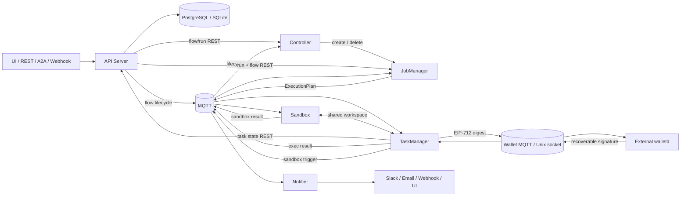

# Flowgent 分布式编排引擎架构

**日期：** 2026-06-08

**状态：** 已实现——活跃 Flow 专用 JobManager + Namespace 范围资源池 Worker

[English](overview.md)

Flowgent 是一个分布式、多命名空间的 AgentFlow 引擎。本文定义跨组件契约：物理服务如何调用、持久状态位于何处、工作如何经 MQTT 流转，以及一次流程如何从触发走到完成。组件内部设计与 L2 DAG 语义由各自文档负责。

## 架构地图

| 层级 | 文档 | 物理或逻辑职责 |
|---|---|---|
| L1 Engine | [API Server](engine/apiserver_ZH.md) | 外部 REST/A2A 网关及唯一数据库客户端 |
| L1 Engine | [Controller](engine/controller_ZH.md) | Flow 发现与活跃 Run 的 JobManager 生命周期 |
| L1 Engine | [资源池](engine/resource-pools_ZH.md) | Worker 容量、放置与 SLA 隔离 |
| L1 Engine | [JobManager](engine/jobmanager_ZH.md) | 单次运行的 DAG 就绪判断、计划创建与运行时容量 |
| L1 Engine | [TaskManager](engine/taskmanager_ZH.md) | Slot worker 与执行器路由 |
| L1 Engine | [Sandbox](engine/sandbox_ZH.md) | 隔离脚本执行与共享工作区 |
| L1 Engine | [Notifier](engine/notifier_ZH.md) | 多渠道投递与 WebSocket UI 推送 |
| L1 Engine | [Wallet 与 x402](engine/wallet_ZH.md) | 可选的外部 EOA key custody 与 EIP-712 digest 签名边界 |
| L2 AgentFlow | [AgentFlow 应用架构](agent-flow_ZH.md) | DAG 配置、节点语义、限制与最佳实践 |

## 跨组件调用契约



| 契约 | 用途 | 禁止的捷径 |
|---|---|---|
| API Server REST | 持久化流程、运行、任务、审批与资源状态 | 非 API 组件 MUST NOT 直连数据库 |
| Flowgent MQTT | 生命周期事件、执行计划/结果、沙箱工作与通知 | 内部引擎协作 MUST NOT 使用 WebSocket/SSE |
| Wallet protocol | 通过独立 MQTT topics 或 Unix socket 执行有界 digest 签名 | Private key 与 Wallet server 配置 MUST NOT 进入 Flowgent |
| 共享工作区 | 大型脚本、仓库与沙箱结果文件 | 大型产物 MUST NOT 经任务状态 JSON 搬运 |
| WebSocket | Notifier 到 UI 的更新与审批交互 | MUST NOT 作为内部调度传输层 |
| Kubernetes API | Controller 管理 JM；JM 管理 TM 与 Sandbox | 导入元数据 MUST NOT 分配运行时 worker |

## 系统调用架构

只有 API Server 连接数据库。其他 Flowgent 组件只通过 MQTT 实时调度总线通信，或调用 API Server REST 更新状态；可选签名通过独立的外部 Wallet protocol 边界完成。内部组件间不使用 SSE/WebSocket；WebSocket 仅供 Notifier 向 UI 推送。

```
═══════════════════════════════════════════════════════════════════════════════════
阶段 1 — 流程设计与触发（同步）
═══════════════════════════════════════════════════════════════════════════════════

  UI / REST / A2A / Webhook          Notifier（仅 WS 推送 UI）
       │                                      ▲
       ▼                                      │
  ┌──────────────────────────────────────────┼──────────────────────────┐
  │                           API Server                               │
  │                                                                    │
  │  • Flow/Agent CRUD → PG（唯一 DB 客户端）          port 9999       │
  │  • Trigger → 创建 PENDING run                     port 9992 (A2A) │
  │  • Flow lifecycle → MQTT create/update/delete 事件                 │
  │  • Flow cache + 热加载（静态 YAML 目录）                            │
  │  • 通过 REST handler 读写状态                                      │
  └──────────┬─────────────────────────────────┬───────────────────────┘
             │                                 │
             ▼                                 ▼
  ┌────────────────────┐            ┌──────────────────────────────────┐
  │   PG / SQLite      │            │         MQTT (EMQX)             │
  │   (仅 apiserver)   │            │        实时调度总线              │
  └────────────────────┘            └──────────────┬───────────────────┘
                                                   │
═══════════════════════════════════════════════════╪═══════════════════════
阶段 2 — 调度（异步）                              │
═══════════════════════════════════════════════════╪═══════════════════════
                                                   │
  Controller                                       │
  • FlowgentClient.ListFlows（apiserver REST）      │
  • MQTT：订阅生命周期事件                          │
  • hash(flow_id) % N → N 路分片                    │
  • MQTT: ctrl.jm.create/{namespace}/{flow} ──────────┤ → 专属 JM
                                                   │
═══════════════════════════════════════════════════╪═══════════════════════
阶段 3 — 执行（异步）                              │
═══════════════════════════════════════════════════╪═══════════════════════
                                                   │
  JobManager                                       │
  • FlowgentClient.ListRuns（apiserver REST）       │
  • 构建 DAG → ExecutionPlan                        │
  • MQTT: .../exec/plans ──────────────────────────┤ → 分派到 TM
  • MQTT: .../exec/results ← consume ──────────────┤ ← TM 结果
  • State: UpdateRun/SaveTask via apiserver REST   │
       │                                           │
       ▼                                           │
  TaskManager（N pods × M slots）                  │
  • $share/tm-pool：消费 ExecutionPlan              │
  • ExecutorRouter：12 种节点类型                    │
  • Skill/sandbox 节点经 MQTT 分派给 SB              │
  • MQTT: .../exec/results ────────────────────────┤ → JM 状态
  • State: SaveTask via apiserver REST             │
       │                                           │
       ▼                                           │
  Sandbox（N pods，独立 Deployment）                │
  • $share/sandbox-pool：消费 TM trigger            │
  • 独立 K8s pod：pod 级 + seccomp-bpf 隔离          │
  • 与 TM 共享 workspace PVC                        │
  • MQTT: .../sandbox/result → TM                  │
                                                   │
  Notifier                                         │
  • $share/notify-pool：消费事件                    │
  • → Slack / Telegram / DingTalk / Email / Webhook│
  • MQTT: notify.result.{namespace}.{flow} ───────────┤ → 投递确认
  • WS → 仅 UI 客户端（人工审批推送）                │
                                                   │
  所有状态写入：FlowgentClient REST → apiserver → PG
═══════════════════════════════════════════════════════════════════════════
```

架构约束如下：

| 约束 | 说明 |
|---|---|
| **只有 apiserver 连接 DB** | PG/SQLite 单一客户端并带流程缓存 |
| **其他组件只用 MQTT 或 apiserver REST** | controller、JM、TM、sandbox、notifier 均不直连 DB |
| **管理链** | controller → JM → TM + Sandbox，后两者由 JM 的 K8sRM 管理 |
| **状态经 apiserver 写入** | 运行/任务状态使用 POST/PUT REST API |
| **实时分派经 MQTT** | ExecutionPlan、沙箱 trigger 与通知事件 |
| **内部通信只用 MQTT** | 组件间不使用 SSE/WS；WS 仅 Notifier→UI |

### 资源池运行时模型

分布式执行只有一种拓扑：Helm 部署 API Server、Controller、Notifier 与可选
A2A；Controller 只为有活跃 Run 的 Flow 创建专用 JobManager；TM/Sandbox 属于
Namespace 范围资源池，只在明确绑定同一 Pool 的 Flow 之间共享。

| 组件 | 所有者 | 范围 |
|---|---|---|
| API Server / Controller / Notifier / A2A | Helm | 平台 |
| JobManager | Controller | namespace + Flow；仅活跃 Run |
| TaskManager / Sandbox | Resource Pool，由活跃 JM 协调 | namespace + pool |

每个 Flow 必须指定 `resource_pool_id`，FlowRun 创建时固化该快照。Pool 的副本、
slot、资源、PriorityClass 与 NodeSelector 提供 SLA 容量；ExecutionPlan 与
SandboxTrigger topic 均包含 namespace/pool，Worker 只订阅并校验自己的范围。
详见[资源池](engine/resource-pools_ZH.md)。

### Controller 与 Flink Operator 的对应关系

| Flink Operator | Flowgent Controller |
|---|---|
| 监听 K8s `FlinkDeployment` CRD | 轮询 apiserver REST `FlowgentClient.ListFlows` |
| 单活并进行 leader election | 按 pod 做 hash-mod N 路分片 |
| CRD 驱动 reconciliation | API 扫描式 reconciliation |

API 轮询避免 CRD 复杂度，并让流程目录始终位于唯一 DB 网关 apiserver 之后。

### 部署命名空间与 Pod 命名

- **系统命名空间：** 默认 `flowgen-system`，可用 `runtime.system_namespace` 或 `FLOWGENT__RUNTIME__SYSTEM_NAMESPACE` 配置。Helm 部署的 apiserver、controller、notifier、a2a 与中间件长期驻留于此。
- **工作负载命名空间：** `{runtime.namespace.namespace_prefix}{namespaceId}`，默认 `flowgent-{namespaceId}`。JobManager、TaskManager 与 Sandbox 位于此处。同一业务 Namespace 的 Flow 共享 K8s namespace；JM 按 Flow 隔离，Worker 按 Resource Pool 隔离。

| 组件 | 必需 | K8s namespace | 职责 |
|---|---|---|---|
| apiserver | 是 | 系统 | REST 网关、认证与触发 |
| controller | 是 | 系统 | 流程发现、run 分派与 hash-mod 分片 |
| jobmanager | 是 | 工作负载 | DAG 编排与任务调度 |
| taskmanager | 是 | 工作负载 | 只消费匹配 Namespace/Pool 的任务 |
| sandbox | 是 | 工作负载 | 只消费匹配 Namespace/Pool 的隔离脚本任务 |
| notifier | 是 | 系统 | 多渠道推送与 WebSocket SSE |
| a2a | 可选 | 系统 | Google Agent-to-Agent 协议入口 |
| walletd | 可选外部服务 | Wallet release 自主管理 | secp256k1 EOA custody 与 EIP-712 digest 签名 |

`a2a` 是可选的 Flowgent Helm 组件。Wallet 独立部署和发布；
`wallet.enabled` 只配置 Flowgent client。All-in-one 模式不嵌入 private-key
custody。

```
系统服务（flowgen-system 中的 Helm release，{hash}=K8s 后缀）：
  flowgent-{component}-{hash}

Flow JM（{hash}=K8s 后缀）：
  flowgent-jobmanager-{namespaceId}-{flowId}-{hash}

Resource Pool Worker（{hash}=K8s 后缀）：
  flowgent-{taskmanager|sandbox}-{namespaceId}-{poolId}-{hash}
```

示例：

```
flowgent-apiserver-abc123
flowgent-controller-ghi789
flowgent-notifier-stu901
flowgent-jobmanager-default-security-autonomy-fixer-xyz001
flowgent-taskmanager-default-security-critical-xyz002
flowgent-sandbox-default-security-critical-xyz003
```

Flow JobManager 的关键 labels：

```yaml
flowgent.io/namespace:       "default"
flowgent.io/flow:            "security-autonomy-fixer"
flowgent.io/resource-pool:   "security-critical"
flowgent.io/runtime-boundary: "flow-jobmanager"
```

Pool Worker 的关键 labels：

```yaml
flowgent.io/namespace:       "default"
flowgent.io/resource-pool:   "security-critical"
flowgent.io/managed-by:      "resource-pool"
```

### 关键设计决策

| 决策 | 理由 |
|---|---|
| **只有 apiserver 连接 DB** | 以单一 PG/SQLite 客户端和缓存消除 N×M 连接池复杂度；其余组件使用 MQTT 或 REST。 |
| **Controller 经 REST 取流程，而非扫描 PG** | `ListFlows()` 配合 MQTT 生命周期事件实现实时更新，仍保留 hash-mod 分片。 |
| **每个 Flow 绑定 Resource Pool** | Pool 的副本、Slot、资源、PriorityClass 与 NodeSelector 将 SLA 容量和放置从编排语义中解耦；Run 快照保证调度确定性。 |
| **JM 管理 TM/Sandbox，Controller 回收孤儿** | 仅 `PENDING`/`RUNNING`/`PAUSED` 的真实运行令 Controller 保留 JM；导入流程/skill 仅登记元数据。JM 管理带标签的 TM/Sandbox；无活动运行或流程删除时回收。活动运行期间 JM 意外消失时，先观察 `runtime.tm_orphan_timeout`（默认 `3m`）再清理。 |
| **运行时凭据通过 K8s Secret `envFrom` 进入 pod** | 主机 shell 环境只作为部署器/console import 输入；`runtime.credential_env_secret` 指定的 Secret 由 Controller 注入 JM，再由 JM K8sRM 可选注入 TM/Sandbox。 |
| **资源定义只保存凭据引用，不保存值** | LLM/MCP API 接受环境变量引用名、读取时脱敏，并只在运行时 Pod 内解析。实际值不得进入浏览器状态、TaskRun payload、OTel attributes、日志或截图。Notification Channel Secret 仍需同等契约后才能开放生产 UI 配置。 |
| **Agent memory 以 `(flow_id, node_id)` 为作用域** | 跨 run 与重启保留；流程间不共享；内容单调累积以供 RAG 召回。 |
| **一个活跃 Flow 一个 JM** | 同一二进制与 DAG 引擎；Controller 只在 Flow 有活跃 Run 时创建专用 JM，Worker 则按 Namespace/Pool 共享。 |
| **A2A 直接使用 `a2aproject/a2a-go` 类型** | ADK `adka2a` 绑定其 session、genai 与内部类型，不兼容 Flowgent DAG；官方 SDK 提供无框架耦合的协议类型。 |
| **Sandbox 是 JM 管理的独立 pod** | K8s NetworkPolicy + RuntimeDefault 提供 pod 级边界，seccomp-bpf + userspace notifier 提供每流程/节点动态 allowlist；独立资源限制避免 TM 与 Sandbox 相互干扰；二者通过按 flowId 组织的 ReadWriteMany PVC 交换脚本与结果。 |
| **网络隔离使用 seccomp-bpf + userspace notifier，而非 iptables** | iptables/Istio 只能给出 pod 级静态策略；`SECCOMP_RET_USER_NOTIF` 可在每次执行前动态安装、随子进程销毁。notifier 解析 host/IP，并通过 `/proc/<pid>/mem` 检查 `connect()`/`sendto()`/`sendmsg()` 目标。BPF 无条件允许 DNS 53 端口、无条件阻止 `SOCK_RAW`。详见 [Sandbox](engine/sandbox_ZH.md)。 |
| **MCP 只支持 HTTP Streamable HTTP，不启动 stdio 子进程** | TM 是无桌面的 K8s 后端 agent；HTTP 让 MCP server 独立部署、伸缩和升级。`McpInfo` 保存 URL 与 headers，而非命令向量。详见 [TaskManager](engine/taskmanager_ZH.md)。 |

## MQTT 事件总线

所有组件间通信都位于 `flowgent/v1/` 统一层级下，以 `{namespaceId}/flows/{flowId}/runs/{runId}` 提供可观测性和多命名空间隔离。只有 apiserver 访问数据库。

```text
# ExecutionPlan：JM → TM
flowgent/v1/{namespace}/pools/{poolId}/flows/{flowId}/runs/{runId}/exec/plans
  JM 发布序列化 ExecutionPlan；TM 只在同一 namespace/pool 共享订阅中负载均衡消费

# 执行结果：TM → JM
flowgent/v1/{namespace}/flows/{flowId}/runs/{runId}/exec/results
  TM 发布 TaskResult；JM 按 run 订阅

# 沙箱触发与结果
flowgent/v1/{namespace}/pools/{poolId}/flows/{flowId}/runs/{runId}/sandbox/trigger
flowgent/v1/{namespace}/flows/{flowId}/runs/{runId}/sandbox/result
  TM 发布 SandboxTrigger；Sandbox 只在同一 namespace/pool 共享订阅中竞争消费
  Sandbox 发布 stdout/stderr/exit_code；发起任务的 TM slot 订阅结果

# Controller → JM 创建请求
flowgent/v1/{namespace}/flows/{flowId}/ctrl/jm/create

# 通知事件与结果
flowgent/v1/{namespace}/flows/{flowId}/runs/{runId}/notify/event
flowgent/v1/{namespace}/flows/{flowId}/runs/{runId}/notify/result

# TM heartbeat
flowgent/v1/heartbeat/{tmId}
  TM 每 5s 发布；JM 订阅 flowgent/v1/heartbeat/+

# Notifier 内部跨 pod WebSocket 路由
flowgent/v1/notify/pod/{podId}/ws/{wsId}

# 状态写入使用 apiserver，不走 MQTT
POST /api/v1/{namespace}/runs/{id}/tasks/{tid}
```

| 发布者 | Topic | 消费者 | 机制 |
|---|---|---|---|
| K8sRM.Schedule | `.../pools/{poolId}/.../exec/plans` | SlotWorker.Loop | Namespace/Pool 范围共享消费 |
| SlotWorker | `.../exec/results` | JobMaster | 按 run 订阅 |
| SandboxExecutor | `.../pools/{poolId}/.../sandbox/trigger` | SandboxRunner | Namespace/Pool 范围共享消费 |
| SandboxRunner | `.../sandbox/result` | SandboxExecutor | 按 run 订阅 |
| Notifier.Publish | `.../notify/event` | Notifier consumer | 每命名空间 `$share/notify-pool` |
| TM heartbeat | `flowgent/v1/heartbeat/{tmId}` | HeartbeatMonitor | 通配订阅全部 TM |

### DAG 执行往返

`exec/plans` → `exec/results` 是 DAG 依赖协调的主干。JM 必须等待一个 plan 的结果，才能把其子节点变为 ready：

```
JM.Execute()              K8sRM.Schedule()              MQTT                     TM.SlotWorker
──────────                ────────────────              ────                     ─────────────
for iteration=1,2,...:
  Ready() → [A,B,...]
  for each nodeID:
    ├─Schedule(plan) ──►  Subscribe exec/results
    │                     Register chan[nodeID]
    │                     Publish exec/plans ──────►  ───────────────────►  $share/tm-pool
    │                                                                       Executor.Execute()
    │                                                                       PUT /tasks (REST)
    │                     ◄── Publish exec/results ──  ◄───────────────────  {plan_id,node_id,state}
    │                     Route er.NodeID → chan[nodeID]
    ◄── TaskResult ──────
    Done(nodeID)          // 下一轮释放子节点
```

`K8sRM.Schedule()` MUST 在发布 `exec/plans` 前注册 `exec/results` 的节点 channel，否则快速 TM 可能先返回结果，令调用一直等待到 `planTimeout`。结果 topic 只携带 `{plan_id,node_id,state}`；TM MUST 先通过 `PUT /api/v1/{namespace}/runs/{id}/tasks/{tid}` 持久化实际输出，再发布状态。JM 之后从 task record 或 `Schedule` 返回值填充的 `nodeOutputs` 读取数据，供后继节点解析变量。

### Pool 标识与队列配置

| Worker | ID 格式 | 示例 |
|---|---|---|
| TaskManager | `pool-{namespace}-{poolId}-tm-{hostname}` | `pool-default-security-critical-tm-k8sm1` |
| Sandbox | K8s `POD_NAME` | `flowgent-sandbox-default-security-critical-e5f6g7h8` |

Worker 身份与 Topic 同时包含 Namespace/Pool；消费者还必须校验 payload 中的
`namespace_id` 与 `resource_pool_id`，避免错误订阅导致跨 Pool 执行。

```yaml
messaging:
  type: mqtt
  mqtt:
    broker: "tcp://<host>:1883"
```

`flowgent/v1/` 是 messager 包中的常量；`messager.ExecPlansTopic(namespace, pool, flow, run)` 等 builder 用路由键生成完整路径。分布式部署 MUST 配置 `messaging.mqtt.broker` 或 `FLOWGENT_MQTT_BROKER`，连接失败或未配置均立即失败。本地 All-in-One 可使用 `StandaloneMessager`。

## ExecutionPlan 与 Checkpoint 契约

```
agentflow_definition（定义 Nodes + Edges）
  └── agentflow_run（一次调用，PENDING→RUNNING→COMPLETED/FAILED）
        ├── execution_plan（plan-node-A，与节点 A 1:1）
        ├── execution_plan（plan-node-B，与节点 B 1:1）
        └── execution_plan（plan-node-C，与节点 C 1:1）
```

每个 DAG 节点产生且只产生一个 `ExecutionPlan`，每个 plan 只属于一个 `AgentFlowRun`。N 节点流程每次运行创建 N 个 plan；plan 序列化为 JSON、持久化至 PG，再分派给 TM slot。字段包括 PlanID、NodeID、AgentFlowRunID、TaskType、Input、RetryPolicy 与 Agent/Tool 引用。

`TaskCheckpoint` 是 DAG 状态的周期快照，包含已完成节点、节点输出与 pending 集合；它允许故障恢复时跳过已完成节点。

## 部署拓扑

### All-in-One（本地开发）

```bash
flowgent all-in-one start -c etc/flowgent.yaml
```

单进程运行 API Server、JM 与 TM，使用 StandaloneRM goroutine 池、SQLite 和内存缓存，仅供开发和小规模独立测试。

### 分布式 Kubernetes

Controller 发现 Flow 存在 `PENDING`、`RUNNING` 或 `PAUSED` Run 后，在工作负载
命名空间 `{namespace_prefix}{namespaceId}` 中确保专用
`flowgent-jobmanager-{namespaceId}-{flowId}` Deployment。JM 读取该 Run 快照的
Resource Pool，通过 K8sRM 协调 `flowgent-taskmanager-{namespaceId}-{poolId}` 与
`flowgent-sandbox-{namespaceId}-{poolId}` 的固定副本、Slot、资源和放置约束。
导入或更新 Flow/Skill 不创建运行资源；没有活跃 Run 时 Controller 删除 Flow JM，
Pool Worker 可供同 Pool 的其他活跃 Flow 继续使用，Pool 删除后由 Controller 回收。

## 端到端执行路径

### 路径 A：API 触发（同步转异步）

```
1. TRIGGER（同步）
   → REST:    POST /api/v1/{namespace}/flows/trigger {agentflow_id, vars}
   → A2A 0.3: POST /  JSON-RPC message/send          {action:start_run, agentflow_id, vars}
   → Webhook: POST /api/v1/webhook/{provider}
       → provider adapter 规范化为 WebhookEvent
       → 每个匹配 {provider,event} 的 flow 各创建一个 run
   → 全部进入 FlowDefHandler.CreateRunFromTrigger：
       → 校验 spec
       → 持久化 PENDING run
       → MQTT 发布 ctrl/run/created
       → 返回 run_id；同步阶段结束

2. JM POLL（异步）
   → runPoller 每 2s 查找本流程的 PENDING run
   → jm.Submit 创建 JobMaster → 解析 DAG → 拓扑分派到 TM
```

### 路径 B：Controller 分派（完全异步）

分布式执行路径：

```
1. CONTROLLER POLL
   → 每 10s 调用 ListFlows
   → 对每个 tick 的 peer 快照做 hash-mod，只处理本 pod 所有的 flow
   → 为这些流程注册 cron/interval trigger
   → 定义导入/更新只处理元数据，不分配 worker
   → API/webhook/cron 创建 PENDING FlowRun
   → reconcile 确保 flowgent-jobmanager-{namespaceId}-{flowId}

2. JM POLL
   → 专属 JM 只获取本流程 run
   → jm.Submit(run, spec) 创建 JobMaster
```

### 公共执行路径

```
3. DAG BUILD
   → 解析 AgentFlowSpec.Nodes + Edges
   → BuildGraphNodes 初始化 DAG
   → 经 RunStateStore.SaveTask / apiserver REST 保存 task run
   → run.Status = RUNNING

4. TOPOLOGICAL LOOP
   → Ready() 取得可运行节点
   → buildPlan → rm.Schedule → Done/Fail
   → condition 记录判断并跳过 false 分支
   → supervisor 校验 Inject/Retry/Abort 动作

5. RM DISPATCH
   → StandaloneRM 使用 goroutine pool，容量满返回 INSUFFICIENT_RESOURCES
   → K8sRM 通过 namespace/pool MQTT topic 发布并协调 Pool 固定容量

6. TM EXECUTION
   → SlotWorker 取出 plan
   → ExecutorRouter 路由到 agent/tool/supervisor/... 执行器
   → 结果经 MQTT 返回 JM

7. COMPLETION
   → IsComplete() 设置 COMPLETED；HasFailed() 设置 FAILED
   → 经 RunStateStore.UpdateRun / apiserver REST 持久化终态
```

TM 故障转移：TM 每 5 秒心跳；JM K8sRM 在 30 秒无心跳后认定死亡；租约到期后由其他 TM 重新领取 plan；K8s Deployment 重启 pod；孤儿 plan 从 checkpoint 重新执行。

## 指标与可观测性

| 信号 | 实现 | 配置 |
|---|---|---|
| Traces | OTLP 导出、W3C TraceContext 跨 MQTT 传播、API Server 代理 Jaeger 的按 Run 规范化查询 | `mgmt.otel` |
| Metrics | Prometheus exporter，按领域配置 histogram bucket | `mgmt.metrics.prometheus` |
| pprof | `:6669` 调试端点 | `mgmt.pprof` |

执行事实与遥测刻意分层，但通过稳定 ID 关联：

| 层次 | 事实来源 | 用途 |
|---|---|---|
| Run DAG | Flow 定义 + 每个 Node 最新的 TaskRun attempt | 逻辑业务进度与 Node 状态 |
| Node attempts | 每次执行一个持久化 TaskRun | 精确的输入/输出/错误、重试链、时间、审计与恢复 |
| Runtime trace | 存储在 Jaeger 的 OpenTelemetry Span | 真实跨服务调用树、事件、延迟与故障定位 |

三者关系为 `DAG Node 1 → N TaskRun attempts 1 → N Spans`。Span attributes
只携带稳定关联标识（`run.id`、`flowgent.node_id`、`flowgent.task_id`、从 1
开始的 `flowgent.attempt`）和有界 payload 元数据（content type、byte size、
SHA-256、capture flag）。完整输入输出、Prompt、模型响应及任意长度预览
**MUST NOT** 写入 Span attributes；它们属于持久化 TaskRun。未来若采用大对象
引用，必须定义显式策略，不能把 tracing backend 当作对象存储。

- Task execution：`[0.1, 0.5, 1, 2, 5, 10, 30, 60, 120]s`
- LLM calls：`[0.5, 1, 2, 5, 10, 30, 60, 120, 300]s`
- Queue latency：`[0.01, 0.05, 0.1, 0.5, 1, 5, 10, 30]s`

## 代码布局与共享模块

`go.work` 串联 16 个 Go module。Wallet 被刻意排除在该 workspace 之外：
Flowgent 只依赖 wire contract，不依赖 Wallet source 或 key-management library。

| Module | 路径 | 职责 |
|---|---|---|
| migration | `migration/` | 数据库 migration |
| common | `pkg/common/` | 日志、tracing 与低依赖工具 |
| model | `pkg/model/` | 共享 engine/API domain types |
| cache | `pkg/cache/` | Memory 与 Redis cache 抽象 |
| config | `pkg/config/` | YAML/environment 加载及运行配置 |
| messager | `pkg/messager/` | Flowgent 内部 memory/MQTT bus 与 topic contract |
| store | `pkg/store/` | Flowgent 自有状态的 PostgreSQL/SQLite store |
| sandbox | `pkg/sandbox/` | 隔离执行、policy 与 seccomp 控制 |
| notifier | `pkg/notifier/` | Delivery channels 与 UI event push |
| core | `pkg/core/` | Executors、JM/TM/RM、LLM/MCP client、x402 policy 与外部 Wallet client |
| controller | `pkg/controller/` | Flow JM、Resource Pool reconciliation 与 lifecycle |
| api | `pkg/api/` | REST handlers 与唯一 durable-state gateway |
| a2a | `pkg/a2a/` | 可选 Agent-to-Agent protocol endpoint |
| console | `pkg/console/` | Flowgent resource CRUD/import/export；不操作 private key |
| cmd | `pkg/cmd/` | Binary composition root 与 service commands |
| tests | `tests/` | 跨 module integration tests |

依赖方向保持向内指向 `common`/`model`，`cmd` 是 composition leaf。非 API
服务 **MUST** 通过 API Server REST 访问 durable engine state。
`core/pkg/client/signclient` 通过 MQTT 或 Unix socket 实现
`wallet.sign.v1`，但不导入任何 Wallet implementation。

独立 Rust 服务在拆分到自身 remote 期间位于 `wallet/`。它独占
`Cargo.toml`、`Cargo.lock`、`Dockerfile`、配置、测试与 Makefile。
Flowgent deployment assets 只配置外部 client，**MUST NOT** 重建 Wallet
Deployment、master-key Secret 或 image build。

## 预期行为

1. **Given** 任一非 API 组件，**when** 它读取或写入持久引擎状态，**then** 请求 MUST 经过 API Server REST，MUST NOT 建立数据库直连。
2. **Given** 一个被接受的触发，**when** run 创建成功，**then** 异步执行开始前 MUST 可观察到一个持久化的 `PENDING` run 及其生命周期事件。
3. **Given** 存在活动 Run，**when** Controller 完成 reconcile，**then** 该 Flow MUST 恰好存在一个受管 JobManager，且 TaskManager/Sandbox 容量 MUST 匹配 Run 的资源池。
4. **Given** 一个可运行 DAG 节点，**when** JobManager 分派它，**then** `exec/results` 订阅路径 MUST 先于 `exec/plans` 发布就绪；只有收到匹配结果后节点才能推进。
5. **Given** 带输出的任务结果，**when** TaskManager 报告完成，**then** 状态型 MQTT 结果解除 JobManager 等待前，实际输出 MUST 已经由 API Server 持久化。
6. **Given** 任一内部引擎交互，**when** 组件通信，**then** MUST 按本文边界使用 REST、MQTT、Kubernetes API 或共享工作区；WebSocket MUST 只存在于 Notifier 到 UI 的边界。
7. **Given** 某流程已无活动 run，**when** 生命周期清理完成，**then** 配置的观察/孤儿窗口之后 MUST NOT 遗留该流程的 JobManager、TaskManager 或 Sandbox workload。
