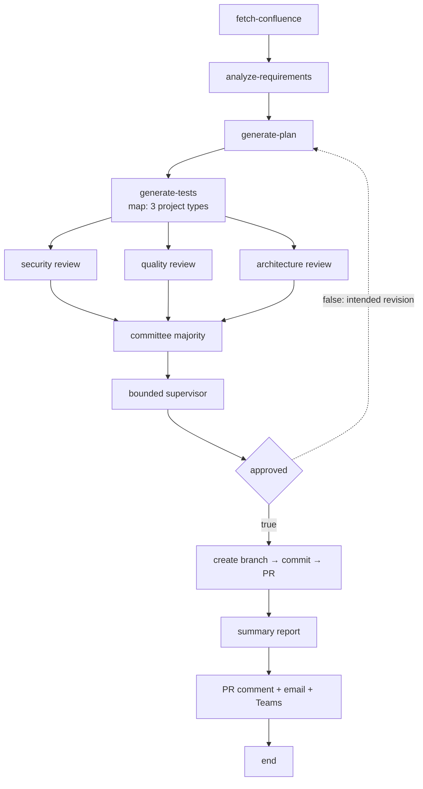

# AutoTest Generator

[中文](README_ZH.md) · [AgentFlow architecture](../../docs/architecture/agent-flow.md)

AutoTest Generator is an L2 AgentFlow application definition for turning a
Confluence requirement into structured test plans and generated Cucumber test
assets, reviewing them, and delivering them through GitHub. It is an early
application definition: the DAG is present, while several referenced agents,
MCP resource manifests, and executable E2E assertions are not yet present.

## Application Boundary

```text
autotest-generator/
├── README.md / README_ZH.md
├── config/
│   ├── flows/       # executable DAG definition
│   ├── agents/      # three currently defined application agents
│   ├── mcps/        # MCP server source; resource manifests remain incomplete
│   └── skills/      # reserved, currently empty
└── e2e/             # runner scaffold; verification guide is currently empty
```

| Resource | Canonical location | Current role |
|---|---|---|
| Flow | [`autotest-generation-v1.yaml`](config/flows/autotest-generation-v1.yaml) | 18-node, 22-edge application DAG |
| Requirement analyst | [`01-requirement-analyst.yaml`](config/agents/01-requirement-analyst.yaml) | Confluence content to strict requirement JSON |
| Test planner | [`02-test-planner.yaml`](config/agents/02-test-planner.yaml) | Per-project test plan |
| Test generator | [`03-test-generator.yaml`](config/agents/03-test-generator.yaml) | Cucumber and step-definition files |
| Verification | [`e2e/VERIFICATION.md`](e2e/VERIFICATION.md) | Empty placeholder; not acceptance evidence |

The YAML manifest is the executable source of truth. This README states both
its intended pipeline and the gaps that currently prevent a self-contained run.

## Flow Contract



The flow declares a weekday cron trigger and a GitHub pull-request webhook. Its
`generate-tests` map has concurrency `3` over `spring-boot`, `flask`, and
`react`. The manifest contains 7 tool nodes, 6 agent nodes, and one each of
`map`, `committee`, `supervisor`, `condition`, and `noop`.

Only the three agent resources listed above currently exist. The flow also
references `security-reviewer`, `quality-reviewer`, `arch-reviewer`, and
`supervisor`. It invokes `confluence` and `github`, but this directory does not
yet contain importable resource manifests for those two MCP identities.

## Current Limits

1. The four review/control agent resources referenced by the flow are absent.
2. Importable Confluence and GitHub MCP resource definitions are absent. The
   existing MCP Go source directories do not by themselves satisfy the flow's
   resource references.
3. `${item}` is used by GitHub delivery nodes outside the `generate-tests` map
   child scope. The manifest needs an explicit repository source and map/join
   data contract before those nodes are executable.
4. The `approved=false` edge points back to `generate-plan`, but current node
   state is one-shot; it does not perform another planning iteration.
5. Email and Teams actions are routed through the `github` tool identity; a
   deployed MCP contract providing those actions is not defined here.
6. [`e2e/VERIFICATION.md`](e2e/VERIFICATION.md) is empty. The application has no
   documented end-to-end acceptance evidence yet.

Runtime credentials MUST enter through deployment Secrets or environment
contracts. They MUST NOT be embedded in the flow, agent files, or README.

## Expected Behavior

1. **Given** the current manifest, **when** it is parsed, **then** it MUST contain
   18 unique nodes and 22 valid edges with the node-type counts stated above.
2. **Given** Confluence content, **when** requirement analysis completes,
   **then** its output MUST follow the analyst's strict requirements JSON shape.
3. **Given** the three configured project types, **when** `generate-tests` runs,
   **then** it MUST create one bounded child execution per item with concurrency
   no greater than three.
4. **Given** generated test assets, **when** approval is evaluated, **then** all
   three review results MUST converge through the deterministic committee and
   bounded supervisor first.
5. **Given** an unresolved agent, MCP, or `${item}` reference, **when** the
   application is prepared for execution, **then** it MUST fail validation or
   readiness explicitly and MUST NOT perform a GitHub mutation.
6. **Given** the current false back-edge, **when** approval fails, **then** the
   completed planning node MUST NOT be reported as a new iteration.
7. **Given** a claim that this use case is E2E-ready, **when** it is reviewed,
   **then** the missing resources must be supplied and the verification guide
   must contain executable assertions and observed evidence.
