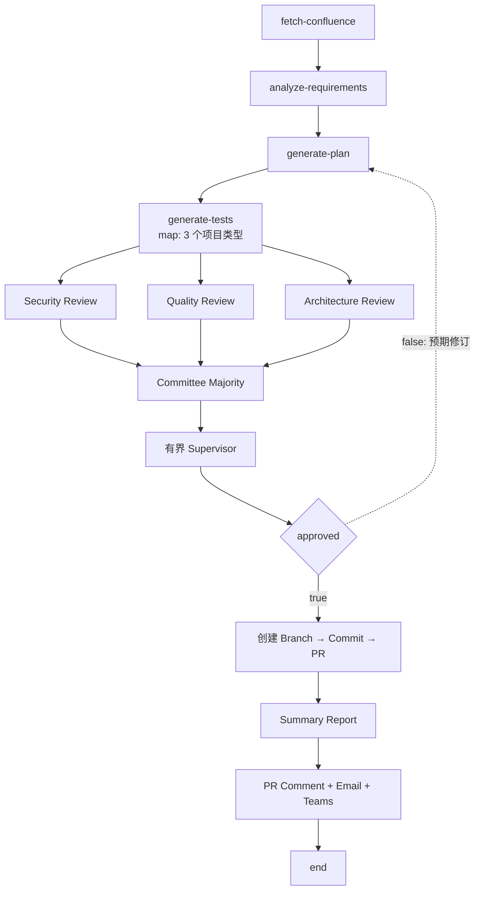

# AutoTest Generator

[English](README.md) · [AgentFlow 架构](../../docs/architecture/agent-flow_ZH.md)

AutoTest Generator 是一个 L2 AgentFlow 应用定义，目标是把 Confluence 需求转换为
结构化测试计划与 Cucumber 测试资产，经评审后通过 GitHub 交付。它目前仍是早期
应用定义：DAG 已存在，但若干被引用的 Agent、MCP Resource Manifest 和可执行
E2E 断言尚不存在。

## 应用边界

```text
autotest-generator/
├── README.md / README_ZH.md
├── config/
│   ├── flows/       # 可执行 DAG 定义
│   ├── agents/      # 当前已有的三个应用 Agent
│   ├── mcps/        # MCP Server 源码；Resource Manifest 尚不完整
│   └── skills/      # 预留，目前为空
└── e2e/             # Runner 脚手架；Verification Guide 当前为空
```

| Resource | 规范位置 | 当前职责 |
|---|---|---|
| Flow | [`autotest-generation-v1.yaml`](config/flows/autotest-generation-v1.yaml) | 18 Nodes、22 Edges 的应用 DAG |
| Requirement analyst | [`01-requirement-analyst.yaml`](config/agents/01-requirement-analyst.yaml) | 将 Confluence 内容转换为严格的需求 JSON |
| Test planner | [`02-test-planner.yaml`](config/agents/02-test-planner.yaml) | 按项目类型生成测试计划 |
| Test generator | [`03-test-generator.yaml`](config/agents/03-test-generator.yaml) | 生成 Cucumber 与 Step Definition 文件 |
| Verification | [`e2e/VERIFICATION.md`](e2e/VERIFICATION.md) | 空 Placeholder，不是验收证据 |

YAML Manifest 是可执行事实源。本 README 同时说明预期 Pipeline 和当前阻止其
自包含运行的缺口。

## Flow 契约



Flow 声明工作日 Cron Trigger 和 GitHub Pull-request Webhook。
`generate-tests` Map 以并发度 `3` 处理 `spring-boot`、`flask` 与 `react`。
Manifest 包含 7 个 Tool Nodes、6 个 Agent Nodes，以及各一个 `map`、
`committee`、`supervisor`、`condition` 和 `noop`。

当前只存在上表中的三个 Agent Resource。Flow 还引用 `security-reviewer`、
`quality-reviewer`、`arch-reviewer` 和 `supervisor`。它调用 `confluence` 与
`github`，但本目录尚无对应这两个 MCP Identity 的可导入 Resource Manifest。

## 当前限制

1. Flow 引用的四个 Review/Control Agent Resource 缺失。
2. 可导入的 Confluence 与 GitHub MCP Resource Definition 缺失；已有 MCP Go
   源码目录本身不能满足 Flow 的 Resource Reference。
3. GitHub 交付 Nodes 在 `generate-tests` Map Child Scope 之外使用 `${item}`。
   Manifest 在可执行前需要明确的 Repository Source 与 Map/Join Data Contract。
4. `approved=false` Edge 指回 `generate-plan`，但当前 Node State 是 One-shot，
   不会产生新一轮 Planning。
5. Email 与 Teams Action 被路由到 `github` Tool Identity，但本目录未定义提供
   这些 Action 的 MCP Contract。
6. [`e2e/VERIFICATION.md`](e2e/VERIFICATION.md) 为空；该应用目前没有文档化的
   E2E 验收证据。

运行凭据 **MUST** 通过部署 Secret 或环境契约注入，**MUST NOT** 写入 Flow、
Agent 文件或 README。

## 预期行为

1. **Given** 当前 Manifest，**when** 解析，**then** 它 **MUST** 包含 18 个唯一
   Nodes、22 条有效 Edges，并符合上述 Node Type 数量。
2. **Given** Confluence 内容，**when** Requirement Analysis 完成，**then** 输出
   **MUST** 符合 Analyst 定义的严格 Requirements JSON 结构。
3. **Given** 三个已配置 Project Types，**when** `generate-tests` 执行，**then**
   **MUST** 为每项创建一个有界 Child Execution，且并发度不得超过三。
4. **Given** 已生成测试资产，**when** 评估 Approval，**then** 三个 Review Result
   **MUST** 先汇聚到确定性 Committee 和有界 Supervisor。
5. **Given** 未解析的 Agent、MCP 或 `${item}` Reference，**when** 准备执行应用，
   **then** **MUST** 明确地 Validation/Readiness 失败，且 **MUST NOT** 修改 GitHub。
6. **Given** 当前 False Back-edge，**when** Approval 失败，**then** 已完成的
   Planning Node **MUST NOT** 被报告为新一轮执行。
7. **Given** 声称本用例已具备 E2E 条件，**when** 评审，**then** 必须先补齐缺失
   Resource，并在 Verification Guide 中提供可执行断言和观测证据。
