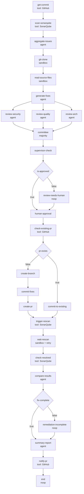

# Security Autonomy Fixer

[中文](README_ZH.md) · [AgentFlow architecture](../../docs/architecture/agent-flow.md) · [E2E verification](e2e/VERIFICATION.md)

Security Autonomy Fixer is a self-contained L2 AgentFlow application. It reads
the target GitHub commit and SonarQube findings, selects bounded source context,
generates and reviews a patch, passes deterministic and human gates, delivers
the change through GitHub, rechecks SonarQube, and posts a final report.

The application is configured under this directory and runs on the generic L1
Flowgent engine. Its nodes, edges, agents, integrations, and verification assets
belong here; the engine does not contain Security Fixer-specific scheduling
logic.

## Application Boundary

```text
security-autonomy-fixer/
├── README.md / README_ZH.md       # application design and review entry
├── config/
│   ├── flows/                     # main flow and optional subflow
│   ├── agents/                    # application-specific agent roles
│   ├── mcps/                      # GitHub and SonarQube integrations
│   ├── llmproviders/              # model/provider definitions
│   └── notifiers/                 # delivery-channel definitions
└── e2e/                           # deployment, verification, evidence, reports
```

| Resource  | Canonical file                                                              | Role                                                                                 |
| --------- | --------------------------------------------------------------------------- | ------------------------------------------------------------------------------------ |
| Main flow | [`security-autonomy-fixer.yaml`](config/flows/security-autonomy-fixer.yaml) | 29-node, 33-edge remediation DAG                                                     |
| Subflow   | [`sub-fix.yaml`](config/flows/sub-fix.yaml)                                 | Three-node analyze → patch → validate flow; currently a separate reusable definition |
| Agents    | [`config/agents/`](config/agents/)                                          | Supervisor, detector, fixer, and three reviewers plus Git role                       |
| MCPs      | [`config/mcps/`](config/mcps/)                                              | GitHub delivery and SonarQube issue/scan access                                      |
| E2E       | [`e2e/VERIFICATION.md`](e2e/VERIFICATION.md)                                | Runtime cluster deployment and white-box assertions                                  |

The YAML manifest is the executable source of truth. This README explains its
intent and current behavior; when they differ, the manifest and observed E2E
evidence take precedence.

## Flow Contract

The main flow has **29 nodes and 33 edges**. It uses eight generic AgentFlow
node types:

| Node type    | Count | Application use                                                          |
| ------------ | ----: | ------------------------------------------------------------------------ |
| `tool`       |    10 | GitHub and SonarQube MCP operations                                      |
| `agent`      |     7 | Finding normalization, patch generation, reviews, comparison, and report |
| `sandbox`    |     3 | Repository clone, bounded source read, and scan wait                     |
| `condition`  |     3 | Review approval, PR route, and completion route                          |
| `committee`  |     1 | Deterministic majority vote                                              |
| `supervisor` |     1 | Quota-bounded orchestration decision                                     |
| `human`      |     1 | Persisted approval before Git mutation                                   |
| `noop`       |     3 | Negative-condition forward fallbacks and terminal node                   |

External MCP integrations are GitHub and SonarQube. Sandbox scripts may also
reach the GitHub repository, the configured proxy endpoint, and SonarQube under
their explicit network allowlists.

## End-to-End DAG



All arrows are executable forward dependencies. Review disagreement is routed
through the persisted human gate, and incomplete re-scan results are captured
in the final report. Repeated remediation requires an explicit bounded subflow
or run boundary until node reset semantics exist.

## Business Stages

|                        Stage | Nodes                                                                                                | Behavior and data boundary                                                                                                             |
| ---------------------------: | ---------------------------------------------------------------------------------------------------- | -------------------------------------------------------------------------------------------------------------------------------------- |
|          1. Commit discovery | `get-commit`                                                                                         | Reads `master` commit metadata from GitHub for `${vars.repo}`.                                                                         |
|         2. Finding discovery | `scan-sonarqube`                                                                                     | Calls SonarQube `GetIssuesSearch` for the repository project and `master` branch.                                                      |
|  3. Normalize and prioritize | `aggregate-issues`                                                                                   | Deduplicates by file/rule, orders severity, and selects at most ten findings.                                                          |
|    4. Bounded source context | `git-clone`, `read-source-files`                                                                     | Clones into the shared workspace, filters generated code, then selects at most one file, two issues, and 12,000 characters by default. |
|            5. Generate fixes | `generate-fixes`                                                                                     | Returns complete corrected file content plus structured patch metadata; it does not return diffs.                                      |
|         6. Multi-role review | `review-security`, `review-quality`, `review-arch`                                                   | Three agent roles independently judge security, quality, and architectural impact.                                                     |
|     7. Deterministic control | `committee`, `supervisor-check`, `is-approved`                                                       | Majority voting stays deterministic; supervisor actions are bounded by retry, node, injection, and action quotas.                      |
|                8. Human gate | `human-approval`                                                                                     | Persists a 24-hour approve/reject gate before any Git mutation.                                                                        |
| 9. Idempotent delivery route | `check-existing-pr`, `pr-exists`, `create-branch`, `commit-fixes`, `create-pr`, `commit-to-existing` | Chooses a new-PR or existing-PR path, then pushes complete file content.                                                               |
|             10. Verification | `trigger-rescan`, `wait-rescan`, `check-resolved`, `compare-results`, `fix-complete`                 | Requests SonarQube findings export, performs bounded polling, compares before/after findings, and determines completion.               |
|                   11. Report | `summary-report`, `notify-pr`, `end`                                                                 | Produces structured summary data, posts it as a GitHub issue/PR comment, and terminates.                                               |

## Nodes and Edges

### Nodes

|     # | Node                                                               | Type         | Principal input or action                                   |
| ----: | ------------------------------------------------------------------ | ------------ | ----------------------------------------------------------- |
|     1 | `get-commit`                                                       | `tool`       | GitHub `get_commit`                                         |
|     2 | `scan-sonarqube`                                                   | `tool`       | SonarQube `GetIssuesSearch`                                 |
|     3 | `aggregate-issues`                                                 | `agent`      | Normalize `${scan-sonarqube}` with `issue-detector`         |
|     4 | `git-clone`                                                        | `sandbox`    | Clone repository with GitHub/proxy allowlist                |
|     5 | `read-source-files`                                                | `sandbox`    | Select bounded files and issues from workspace              |
|     6 | `generate-fixes`                                                   | `agent`      | Produce schema-constrained `files` and `patches`            |
|   7–9 | `review-security`, `review-quality`, `review-arch`                 | `agent`      | Independent structured patch votes                          |
|    10 | `committee`                                                        | `committee`  | Majority of the three review decisions                      |
|    11 | `supervisor-check`                                                 | `supervisor` | `continue`, `retry`, `inject`, or `abort` within quotas     |
|    12 | `is-approved`                                                      | `condition`  | `${committee.decision} == true`                             |
|    13 | `human-approval`                                                   | `human`      | 24-hour persisted gate                                      |
|    14 | `check-existing-pr`                                                | `tool`       | GitHub `list_pull_requests`                                 |
|    15 | `pr-exists`                                                        | `condition`  | Current manifest expression is literal `true`               |
| 16–19 | `create-branch`, `commit-fixes`, `create-pr`, `commit-to-existing` | `tool`       | GitHub delivery to `fix/flowgent_sec_auto_fix`              |
|    20 | `trigger-rescan`                                                   | `tool`       | SonarQube `GetProjectsExportFindings`                       |
|    21 | `wait-rescan`                                                      | `sandbox`    | Poll CE activity with 12 attempts and fixed 10-second delay |
|    22 | `check-resolved`                                                   | `tool`       | SonarQube post-change `GetIssuesSearch`                     |
|    23 | `compare-results`                                                  | `agent`      | Classify complete/partial/none/max-iterations result        |
|    24 | `fix-complete`                                                     | `condition`  | Complete or max-iterations decision                         |
|    25 | `summary-report`                                                   | `agent`      | Structured final report and PR number                       |
|    26 | `notify-pr`                                                        | `tool`       | GitHub `add_issue_comment`                                  |
|    27 | `end`                                                              | `noop`       | Terminal                                                    |

### Conditional Edges

The other 27 edges are unconditional dependencies. These six edges carry an
explicit Boolean condition:

| From           | Condition | To                       | Current meaning                                                            |
| -------------- | --------: | ------------------------ | -------------------------------------------------------------------------- |
| `is-approved`  |    `true` | `human-approval`         | Approved review enters the persisted human gate directly                   |
| `is-approved`  |   `false` | `review-needs-human`     | Negative review enters the same gate through an auditable fallback node    |
| `pr-exists`    |   `false` | `create-branch`          | New branch and PR path                                                     |
| `pr-exists`    |    `true` | `commit-to-existing`     | Push to the fixed existing branch path                                     |
| `fix-complete` |    `true` | `summary-report`         | Complete remediation enters reporting directly                             |
| `fix-complete` |   `false` | `remediation-incomplete` | Incomplete remediation enters reporting through an auditable fallback node |

## Application Resources

| Resource          | Files                                                          | Role                                                                                                                      |
| ----------------- | -------------------------------------------------------------- | ------------------------------------------------------------------------------------------------------------------------- |
| Agent definitions | `config/agents/01-supervisor.yaml` through `07-git-agent.yaml` | Model, instruction, schema, and role configuration                                                                        |
| LLM provider      | `config/llmproviders/deepseek.yaml`                            | Model/provider connection used by the agents                                                                              |
| GitHub MCP        | `config/mcps/github.yaml`                                      | Commit lookup, PR lookup, branch creation, file push, PR creation, and comment delivery                                   |
| SonarQube MCP     | `config/mcps/sonarqube.yaml`                                   | Finding discovery, export/recheck, and post-change comparison input                                                       |
| Notifiers         | `config/notifiers/email.yaml`, `webhook.yaml`                  | Importable notification-channel definitions; the main 29-node DAG currently terminates through a GitHub comment tool node |

Runtime credentials MUST enter through the configured deployment Secret or
environment contract. They MUST NOT be embedded in flow, agent, MCP, or README
files.

## Current Limits

1. `pr-exists.expression` is the literal `true`, so the current manifest always
   selects `commit-to-existing`. A reusable version MUST derive this condition
   from `check-existing-pr` output.
2. Review disagreement still enters the human gate, and incomplete re-scan
   results still enter `summary-report`; this is the safe one-shot fallback
   until repeated-node reset semantics exist.
3. `${vars.iteration}` starts at `0` and this flow does not mutate it. The
   `max_iterations` comparison does not by itself implement repeated runs.
4. Review siblings are logically independent but are currently dispatched
   sequentially because JobManager blocks on each `Schedule()`.
5. `trigger-rescan` calls `GetProjectsExportFindings`; `wait-rescan` observes CE
   activity. The exact external scan trigger behavior remains defined by the
   deployed SonarQube integration and project CI.
6. The `sub-fix` definition is not referenced by a node in the main manifest;
   it is a separate reusable flow, not part of the 29-node execution path.

Until repeated-node reset semantics exist, an executable multi-pass design
MUST use a bounded node retry or an explicit subflow/run boundary.

## Verification

[`e2e/VERIFICATION.md`](e2e/VERIFICATION.md) is the canonical operational guide
for the Kubernetes runtime-cluster environment. Its verifiers cover infrastructure,
resource import, telemetry, API Server, Notifier, Controller, MQTT, A2A,
the remediation stages, PR commits, knowledge, and shared workspace.

Generated reports and `.last_*` files are execution evidence, not design
sources. They MUST NOT replace assertions against the manifest, REST state,
MQTT routing, PostgreSQL, Kubernetes resources, or external-system outcomes.

## Expected Behavior

1. **Given** the main manifest, **when** it is loaded, **then** it MUST contain
   29 uniquely named nodes and 33 valid edges with the node-type counts stated
   above.
2. **Given** SonarQube findings, **when** source context is selected, **then**
   generated-code paths SHOULD be excluded and the configured file, issue, and
   character bounds MUST be respected.
3. **Given** generated fixes, **when** reviews complete, **then** all three votes
   MUST feed the deterministic committee before supervisor or human approval.
4. **Given** any Git mutation, **when** it becomes eligible, **then** committee,
   supervisor, condition, and persisted human gates MUST already have passed.
5. **Given** either delivery branch, **when** code is pushed, **then** the flow
   MUST converge on SonarQube recheck, comparison, report, and GitHub comment.
6. **Given** a negative review or incomplete re-scan, **when** one-shot runtime
   execution continues, **then** it MUST reach the human gate or final report
   without attempting to rerun an already-completed node.
7. **Given** application review or E2E verification, **when** observed behavior
   conflicts with this explanation, **then** the executable manifest and
   observed runtime evidence MUST be treated as authoritative.
