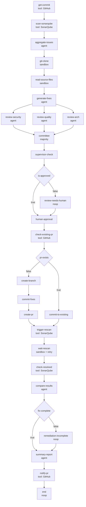

# Security Autonomy Fixer

[English](README.md) · [AgentFlow 架构](../../docs/architecture/agent-flow_ZH.md) · [E2E 验证](e2e/VERIFICATION.md)

Security Autonomy Fixer 是一个自包含的 L2 AgentFlow 应用。它读取目标 GitHub
Commit 和 SonarQube Findings，选择有界源码上下文，生成并评审 Patch，通过确定性
门禁与人工审批，经 GitHub 交付修改，重新检查 SonarQube，最后发布报告。

应用的全部配置位于本目录，并运行在通用 L1 Flowgent 引擎之上。Nodes、Edges、
Agents、Integrations 与验证资产属于本应用；引擎不包含 Security Fixer 专属调度逻辑。

## 应用边界

```text
security-autonomy-fixer/
├── README.md / README_ZH.md       # 应用设计与评审入口
├── config/
│   ├── flows/                     # 主流程和可选子流程
│   ├── agents/                    # 应用专属 Agent Roles
│   ├── mcps/                      # GitHub 与 SonarQube Integrations
│   ├── llmproviders/              # Model/Provider 定义
│   └── notifiers/                 # 投递 Channel 定义
└── e2e/                           # 部署、验证、证据与报告
```

| 资源   | 规范文件                                                                    | 作用                                                    |
| ------ | --------------------------------------------------------------------------- | ------------------------------------------------------- |
| 主流程 | [`security-autonomy-fixer.yaml`](config/flows/security-autonomy-fixer.yaml) | 29 Nodes、33 Edges 的修复 DAG                           |
| 子流程 | [`sub-fix.yaml`](config/flows/sub-fix.yaml)                                 | 三节点 analyze → patch → validate；当前为独立可复用定义 |
| Agents | [`config/agents/`](config/agents/)                                          | Supervisor、Detector、Fixer、三个 Reviewer 与 Git Role  |
| MCPs   | [`config/mcps/`](config/mcps/)                                              | GitHub 交付与 SonarQube Issue/Scan 访问                 |
| E2E    | [`e2e/VERIFICATION.md`](e2e/VERIFICATION.md)                                | Application 模式部署及白盒断言                          |

YAML Manifest 是可执行事实来源。本文解释其意图和当前行为；发生差异时，以
Manifest 与实际 E2E 证据为准。

## Flow 契约

主流程有 **29 个 Nodes、33 条 Edges**，使用 8 种通用 AgentFlow Node：

| Node Type    | 数量 | 应用用途                                       |
| ------------ | ---: | ---------------------------------------------- |
| `tool`       |   10 | GitHub 与 SonarQube MCP 操作                   |
| `agent`      |    7 | Finding 规范化、Patch 生成、Review、比较与报告 |
| `sandbox`    |    3 | 仓库 Clone、有界源码读取与等待 Scan            |
| `condition`  |    3 | Review 批准、PR 路由与完成路由                 |
| `committee`  |    1 | 确定性多数投票                                 |
| `supervisor` |    1 | 受 Quota 约束的编排决策                        |
| `human`      |    1 | Git 修改前的持久化人工审批                     |
| `noop`       |    3 | 否定条件前向兜底与终止节点                     |

外部 MCP 集成为 GitHub 与 SonarQube。Sandbox Script 还可在明确的 Network
Allowlist 下访问 GitHub 仓库、配置的 Proxy Endpoint 与 SonarQube。

## 端到端 DAG



全部箭头都是当前可执行的前向依赖。Review 反对意见进入持久化人工门禁，复扫
未完成结果进入最终报告。在 Node Reset 语义实现前，多轮修复必须使用显式有界
Subflow 或 Run 边界。

## 业务阶段

|              阶段 | Nodes                                                                                                | 行为与数据边界                                                                             |
| ----------------: | ---------------------------------------------------------------------------------------------------- | ------------------------------------------------------------------------------------------ |
|    1. Commit 发现 | `get-commit`                                                                                         | 从 GitHub 读取 `${vars.repo}` 的 `master` Commit Metadata。                                |
|   2. Finding 发现 | `scan-sonarqube`                                                                                     | 对仓库 Project 和 `master` Branch 调用 SonarQube `GetIssuesSearch`。                       |
|   3. 规范化与排序 | `aggregate-issues`                                                                                   | 按 File/Rule 去重，按 Severity 排序，最多选择 10 个 Findings。                             |
| 4. 有界源码上下文 | `git-clone`, `read-source-files`                                                                     | Clone 到共享 Workspace，过滤生成代码；默认至多 1 个文件、2 个 Issues、每文件 12,000 字符。 |
|       5. 生成修复 | `generate-fixes`                                                                                     | 返回完整修正文件内容与结构化 Patch Metadata，而不是 Diff。                                 |
|  6. 多角色 Review | `review-security`, `review-quality`, `review-arch`                                                   | 三个 Agent 独立判断安全、质量和架构影响。                                                  |
|     7. 确定性控制 | `committee`, `supervisor-check`, `is-approved`                                                       | 多数投票保持确定性；Supervisor 受 Retry、Node、Injection 与 Action Quota 约束。            |
|       8. 人工门禁 | `human-approval`                                                                                     | 在任何 Git 修改前持久化 24 小时 Approve/Reject Gate。                                      |
|   9. 幂等交付路由 | `check-existing-pr`, `pr-exists`, `create-branch`, `commit-fixes`, `create-pr`, `commit-to-existing` | 选择新 PR 或已有 PR 路径，再推送完整文件内容。                                             |
|          10. 验证 | `trigger-rescan`, `wait-rescan`, `check-resolved`, `compare-results`, `fix-complete`                 | 请求 SonarQube Findings Export、有界轮询、比较前后 Findings 并判断完成。                   |
|          11. 报告 | `summary-report`, `notify-pr`, `end`                                                                 | 生成结构化摘要，通过 GitHub Issue/PR Comment 发布并终止。                                  |

## Nodes 与 Edges

### Nodes

|     # | Node                                                               | Type         | 主要输入或动作                                      |
| ----: | ------------------------------------------------------------------ | ------------ | --------------------------------------------------- |
|     1 | `get-commit`                                                       | `tool`       | GitHub `get_commit`                                 |
|     2 | `scan-sonarqube`                                                   | `tool`       | SonarQube `GetIssuesSearch`                         |
|     3 | `aggregate-issues`                                                 | `agent`      | 用 `issue-detector` 规范化 `${scan-sonarqube}`      |
|     4 | `git-clone`                                                        | `sandbox`    | 在 GitHub/Proxy Allowlist 下 Clone                  |
|     5 | `read-source-files`                                                | `sandbox`    | 从 Workspace 选择有界文件与 Issues                  |
|     6 | `generate-fixes`                                                   | `agent`      | 生成受 Schema 约束的 `files` 与 `patches`           |
|   7–9 | `review-security`, `review-quality`, `review-arch`                 | `agent`      | 独立结构化 Patch Votes                              |
|    10 | `committee`                                                        | `committee`  | 三个 Review Decision 的多数投票                     |
|    11 | `supervisor-check`                                                 | `supervisor` | Quota 内的 `continue`、`retry`、`inject` 或 `abort` |
|    12 | `is-approved`                                                      | `condition`  | `${committee.decision} == true`                     |
|    13 | `human-approval`                                                   | `human`      | 24 小时持久化门禁                                   |
|    14 | `check-existing-pr`                                                | `tool`       | GitHub `list_pull_requests`                         |
|    15 | `pr-exists`                                                        | `condition`  | 当前 Manifest Expression 为 Literal `true`          |
| 16–19 | `create-branch`, `commit-fixes`, `create-pr`, `commit-to-existing` | `tool`       | 交付到 `fix/flowgent_sec_auto_fix`                  |
|    20 | `trigger-rescan`                                                   | `tool`       | SonarQube `GetProjectsExportFindings`               |
|    21 | `wait-rescan`                                                      | `sandbox`    | 12 次、固定 10 秒 Delay 的 CE Activity Polling      |
|    22 | `check-resolved`                                                   | `tool`       | 修改后 SonarQube `GetIssuesSearch`                  |
|    23 | `compare-results`                                                  | `agent`      | 分类 complete/partial/none/max-iterations           |
|    24 | `fix-complete`                                                     | `condition`  | Complete 或 Max-iterations Decision                 |
|    25 | `summary-report`                                                   | `agent`      | 结构化最终报告与 PR Number                          |
|    26 | `notify-pr`                                                        | `tool`       | GitHub `add_issue_comment`                          |
|    27 | `end`                                                              | `noop`       | 终止                                                |

### 条件 Edges

其余 27 条 Edges 是无条件依赖；以下 6 条携带显式 Boolean Condition：

| From           | Condition | To                       | 当前含义                                    |
| -------------- | --------: | ------------------------ | ------------------------------------------- |
| `is-approved`  |    `true` | `human-approval`         | Review 通过后直接进入持久化人工门禁         |
| `is-approved`  |   `false` | `review-needs-human`     | Review 反对时经可审计兜底 Node 进入同一门禁 |
| `pr-exists`    |   `false` | `create-branch`          | 新 Branch 与 PR 路径                        |
| `pr-exists`    |    `true` | `commit-to-existing`     | 推送固定已有 Branch 路径                    |
| `fix-complete` |    `true` | `summary-report`         | 修复完成后直接进入报告                      |
| `fix-complete` |   `false` | `remediation-incomplete` | 修复未完成时经可审计兜底 Node 进入报告      |

## 应用资源

| 资源              | 文件                                                      | 作用                                                                |
| ----------------- | --------------------------------------------------------- | ------------------------------------------------------------------- |
| Agent Definitions | `config/agents/01-supervisor.yaml` 至 `07-git-agent.yaml` | Model、Instruction、Schema 与 Role 配置                             |
| LLM Provider      | `config/llmproviders/deepseek.yaml`                       | Agents 使用的 Model/Provider Connection                             |
| GitHub MCP        | `config/mcps/github.yaml`                                 | Commit/PR 查询、Branch 创建、文件推送、PR 创建与 Comment            |
| SonarQube MCP     | `config/mcps/sonarqube.yaml`                              | Finding 发现、Export/Recheck 与修改后比较输入                       |
| Notifiers         | `config/notifiers/email.yaml`, `webhook.yaml`             | 可导入的通知 Channel；29 节点主 DAG 当前以 GitHub Comment Tool 终止 |

运行时凭据 **MUST** 通过部署 Secret 或环境契约注入，**MUST NOT** 嵌入 Flow、
Agent、MCP 或 README。

## 当前限制

1. `pr-exists.expression` 是 Literal `true`，因此当前 Manifest 总是选择
   `commit-to-existing`。可复用版本 **MUST** 从 `check-existing-pr` 输出导出条件。
2. Review 反对仍进入人工门禁，复扫未完成仍进入 `summary-report`；这是重复
   Node Reset 语义实现前的安全 One-shot Fallback。
3. `${vars.iteration}` 初始为 `0`，本流程不会修改它；`max_iterations` 比较本身
   不会实现重复执行。
4. Review Siblings 逻辑独立，但 JobManager 对每个 `Schedule()` 阻塞，因此当前
   仍顺序分派。
5. `trigger-rescan` 调用 `GetProjectsExportFindings`，`wait-rescan` 观察 CE Activity；
   实际外部 Scan Trigger 行为仍由部署的 SonarQube Integration 与项目 CI 定义。
6. 主 Manifest 没有 Node 引用 `sub-fix`；它是独立可复用 Flow，不属于 29 节点路径。

重复节点 Reset 语义实现前，可执行的多轮设计 **MUST** 使用有界 Node Retry 或
明确的 Subflow/Run 边界。

## 验证

[`e2e/VERIFICATION.md`](e2e/VERIFICATION.md) 是 Application 模式环境的规范运维
指南。Verifier 覆盖 Infrastructure、Resource Import、Telemetry、API Server、
Notifier、Controller、MQTT、A2A、修复阶段、PR Commit、Knowledge 与
共享 Workspace。

生成的 Report 和 `.last_*` 文件是执行证据，不是设计来源。它们 **MUST NOT**
替代对 Manifest、REST State、MQTT Routing、PostgreSQL、Kubernetes Resource
或外部系统结果的断言。

## 预期行为

1. **给定**主 Manifest，**当**加载时，**则 MUST** 包含 29 个唯一命名 Nodes、
   33 条有效 Edges，并符合上述 Node Type 数量。
2. **给定** SonarQube Findings，**当**选择源码上下文时，**则 SHOULD** 排除生成
   代码路径，并 **MUST** 遵守配置的文件、Issue 与字符上限。
3. **给定**生成的 Fixes，**当** Review 完成时，**则**三个 Vote **MUST** 在
   Supervisor 或人工审批前全部进入确定性 Committee。
4. **给定**任一 Git 修改，**当**它可执行时，**则** Committee、Supervisor、
   Condition 与持久化人工门禁 **MUST** 已全部通过。
5. **给定**任一交付分支，**当**代码被 Push 时，**则**流程 **MUST** 汇合到
   SonarQube Recheck、Comparison、Report 与 GitHub Comment。
6. **给定** Review 反对或复扫未完成，**当** One-shot Runtime 继续执行时，
   **则 MUST** 到达人工门禁或最终报告，且不得尝试重跑已完成 Node。
7. **给定**应用评审或 E2E 验证，**当**观察行为与本文冲突时，**则 MUST** 以
   可执行 Manifest 和实际 Runtime 证据为准。
